# Getting Started

In this tutorial you build a small mounting bracket: a 60 × 40 mm plate, 5 mm thick, with two mounting holes and rounded corners. Then you make it thicker without starting over, and export it as an STL file for 3D printing. It takes about 15 minutes, and along the way you meet the ideas the rest of Part3D is built on.

Part3D on iPad is made for Apple Pencil. Draw and pick things on the canvas with the Pencil, and use your fingers to move the view: drag with one finger to turn it, pinch to zoom. Buttons and panels work with either.

> [!TIP]
> All sizes here are in millimetres. If you work in inches, tap the gear in the toolbar at the bottom of the screen and pick **in** under **Units**. Use the same numbers, or convert them.

## 1. Create a new Document

A **Document** is one design, saved as a `.part3d` file. It holds everything you make for that object.

On the Documents screen, tap **New File**. An empty Document named **Untitled** opens in the Editor.

## 2. Sketch a rectangle on the Top plane

A **Sketch** is a flat 2D drawing on a plane. Solids start as sketches: you draw a shape, then turn it into 3D.

1. In the sidebar, tap **Create Sketch**.

   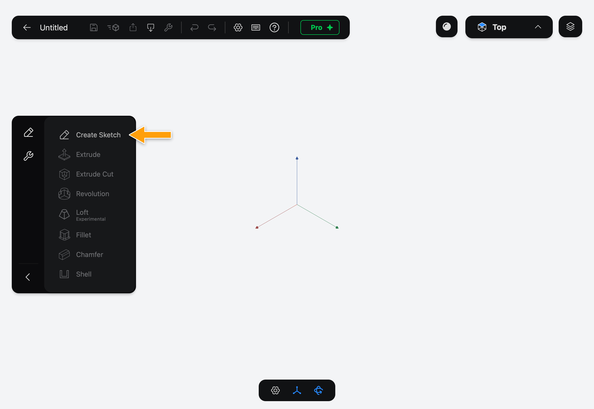

2. The first time, a **Creating a Sketch** tip appears. Tap **Got it**. The three Origin Planes appear. Tap the one labelled **Top**, the flat one. The view turns to look straight down on it, and the **Editing Sketch** panel opens.

   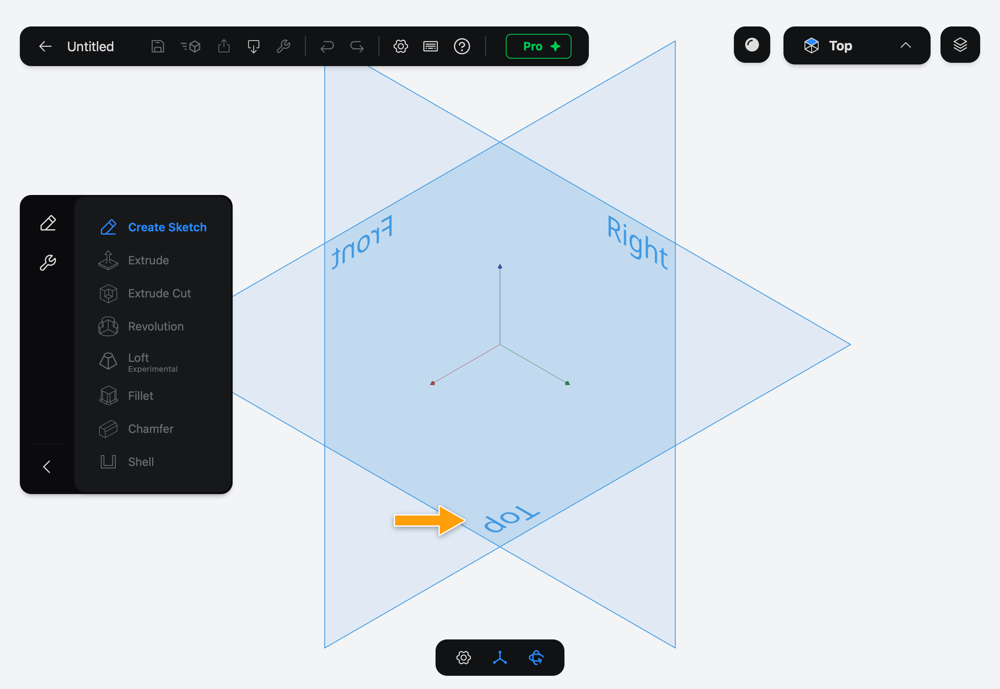

3. In the sidebar, tap **Rectangle**. With the Pencil, drag from one corner to the opposite corner to draw a rectangle about 60 mm wide and 40 mm tall, roughly centred on the origin. It doesn't need to be exact: the next step sets the sizes. Tap **Rectangle** again to put the Tool away.

   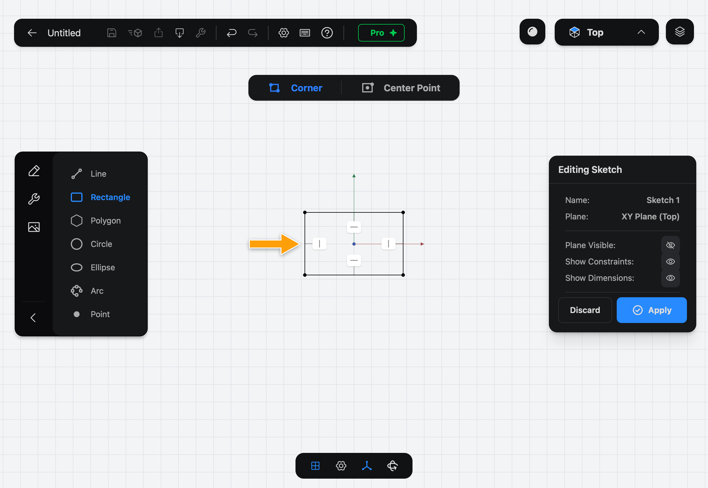

## 3. Set its size with Line Length

A **Constraint** is a rule the sketch has to follow, like "this line is horizontal" or "this line is 60 mm long". The small badges on the rectangle are Constraints Part3D added for you: its sides stay horizontal and vertical. When you change a size, Part3D moves the shape to keep every rule true.

1. Tap the bottom edge of the rectangle. It turns blue and a **⋯** button appears next to it. Tap **⋯**, then **Line Length**.

   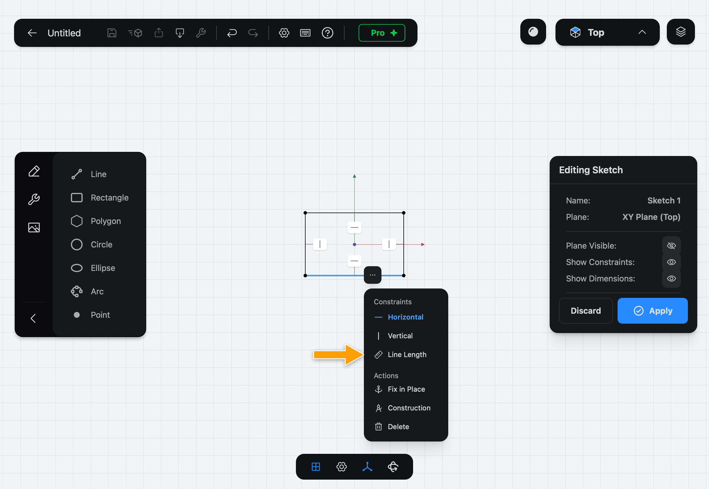

2. A dimension shows the edge's current length. Tap the number to open the numpad, enter `60`, and tap **Set 60.0 mm**. The rectangle stretches to 60 mm.

   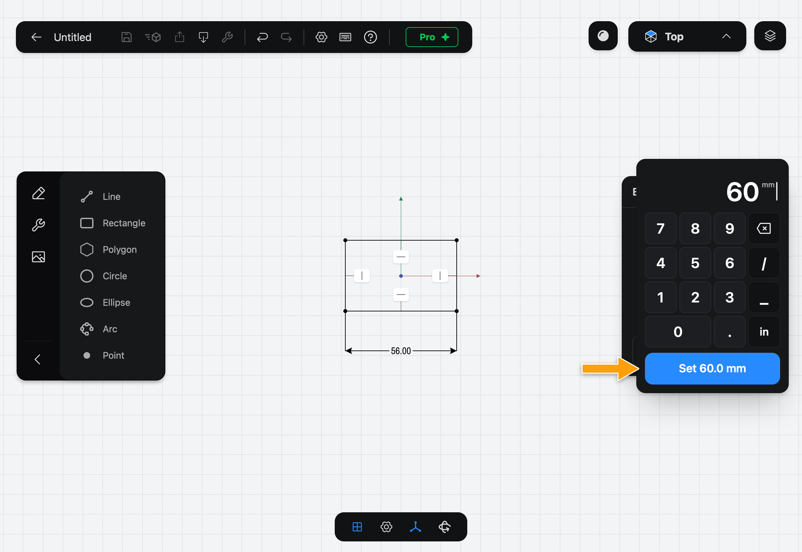

3. Do the same for the right edge: tap it, tap **⋯**, tap **Line Length**, tap its number, enter `40`, and tap **Set 40.0 mm**.

4. The rectangle is now exactly 60 × 40 mm. Tap **Apply** to finish the sketch.

   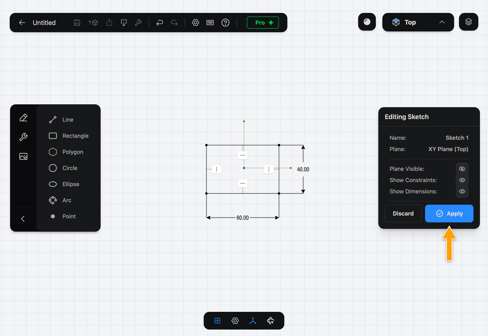

## 4. Extrude it into a plate

A **Feature** is one modeling step, like an Extrude, a Hole or a Fillet. Each modeling Tool adds a Feature, and each Feature remembers its settings, so you can change them later.

1. Drag with one finger to turn the view so you look at the sketch from an angle.
2. In the sidebar, tap **Extrude**. The panel asks you to **Tap Sketch Face**. Tap inside the rectangle; the field changes to **1 Sketch Face** and a blue preview appears.
3. Tap the **Length** value, enter `5`, and tap **Set 5.0 mm**. The preview becomes a 5 mm plate.

   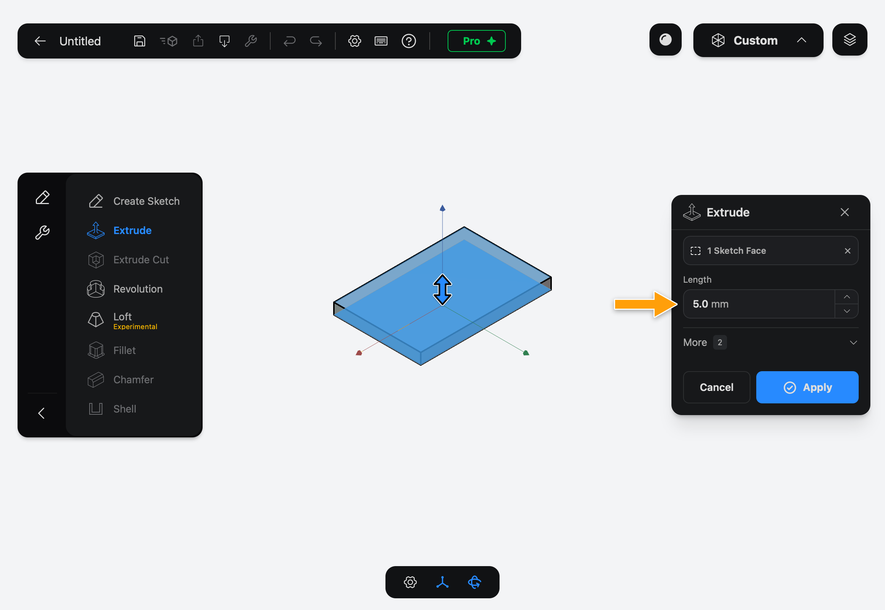

4. Tap **Apply**. The plate is now a solid.

## 5. Add two mounting holes

A Hole drills through the solid at points you place in a sketch, so first sketch the two points on the top of the plate.

1. Tap **Create Sketch** again, and this time tap the top face of the plate. Sketches can sit on any flat face, not just on the Origin Planes.

   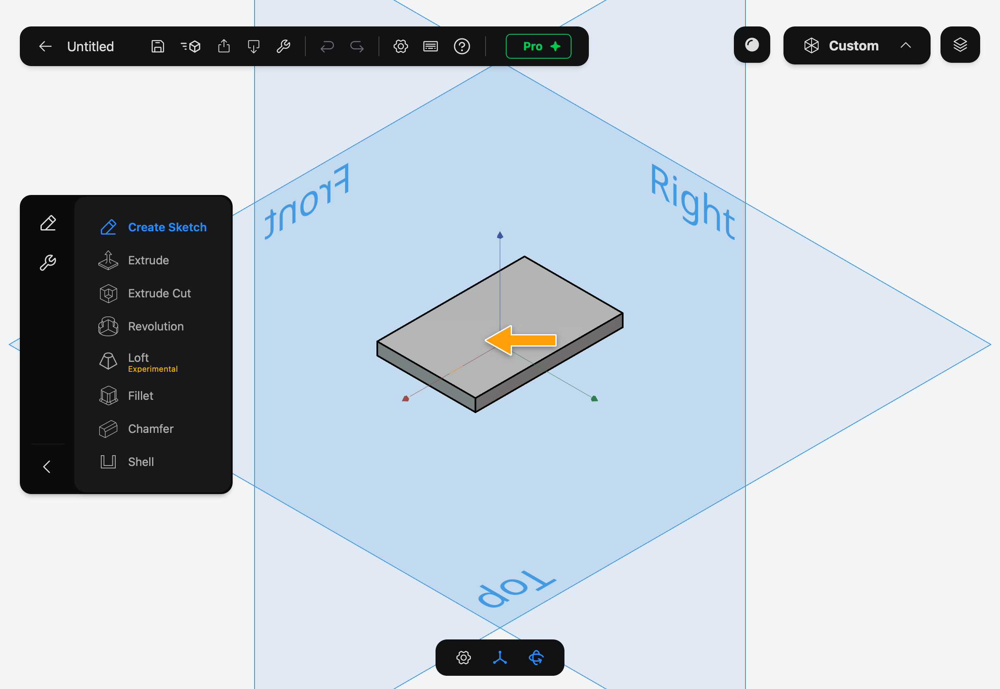

2. The view turns to look down on the face. In the sidebar, tap **Point**, then tap two spots on the plate, one on each side of the middle, about 18 mm from it. Tap **Point** again to put the Tool away, then tap **Apply**.

   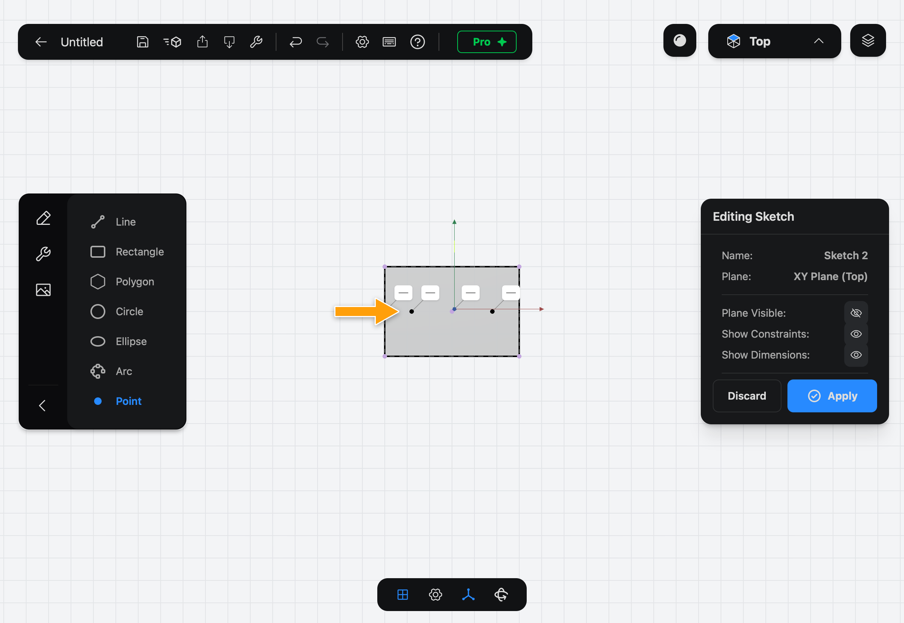

3. Turn the view so you see the plate from an angle again. The sidebar has two tabs: tap the wrench icon to show the **Tools** tab, then tap **Hole**.
4. Tap the two points you drew. The field shows **2 Sketch Points**, and a blue arrow at each point shows which way it drills: down into the plate.
5. Tap the **Diameter** value, enter `6`, and tap **Set 6.0 mm**.

   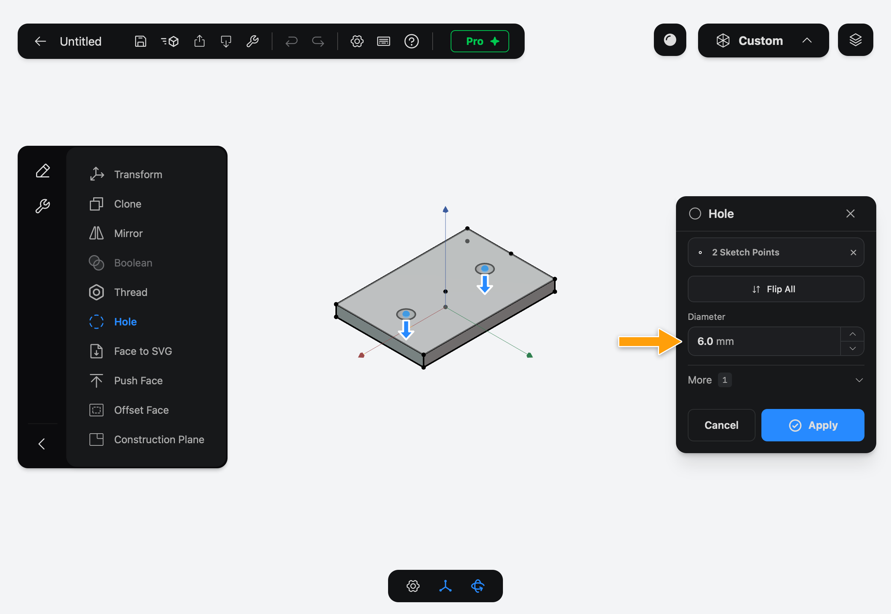

6. Tap **Apply**. The plate now has two 6 mm holes, right through it.

## 6. Round the corners with Fillet

1. Tap the pencil icon at the top of the sidebar to go back to the **Features** tab, then tap **Fillet**.
2. The panel asks you to **Tap Edges**. Tap the four short vertical edges at the corners of the plate. The field shows **4 Edges**.
3. Tap the **Radius** value, enter `5`, and tap **Set 5.0 mm**. The preview shows the rounded corners.

   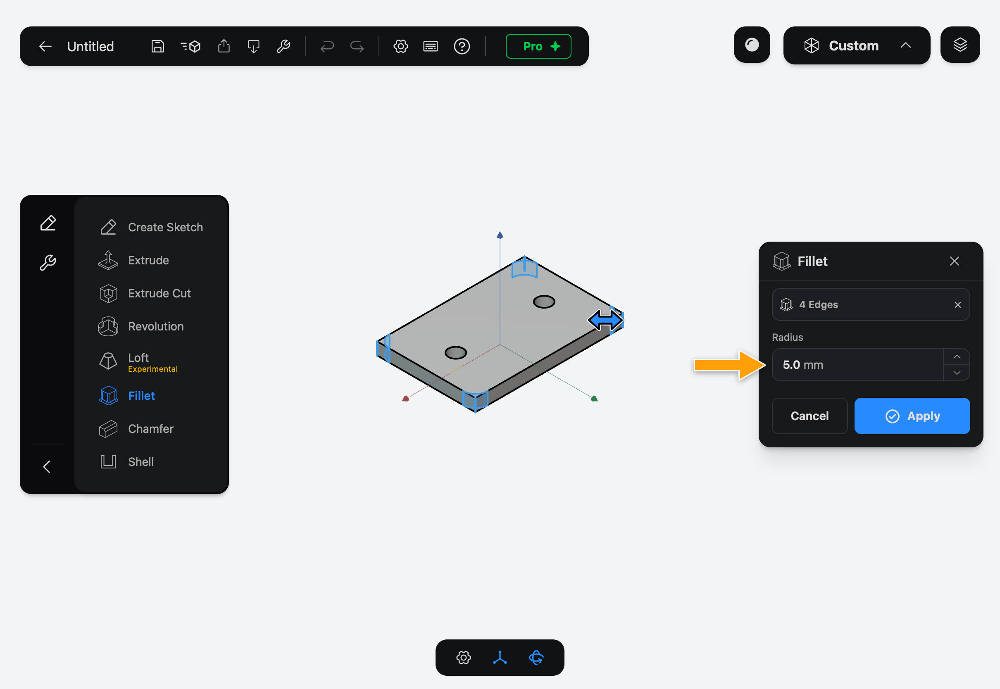

4. Tap **Apply**.

## 7. Change the thickness in the History

The **History** is the list of your Features, in the order you added them. Part3D builds the solid by replaying that list, so when you change an early Feature, every Feature after it is rebuilt on top of the change. This is what "parametric" means: your model is a recipe, not a lump of clay.

1. Tap the layers icon in the top-right corner, then the History tab (the timer icon). It lists **Extrude**, **Hole** and **Fillet**.
2. Tap **Extrude**, then tap **Edit**.

   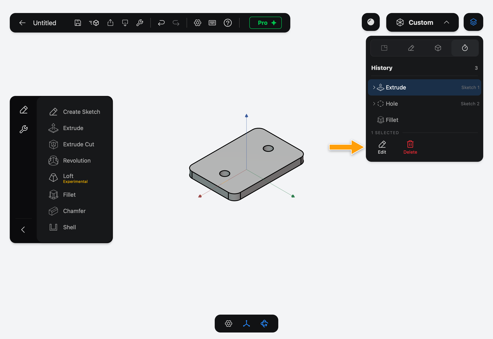

3. The Extrude panel opens with its settings, and the view shows the model as it was at that step. Tap the **Length** value, enter `10`, and tap **Set 10.0 mm**.

   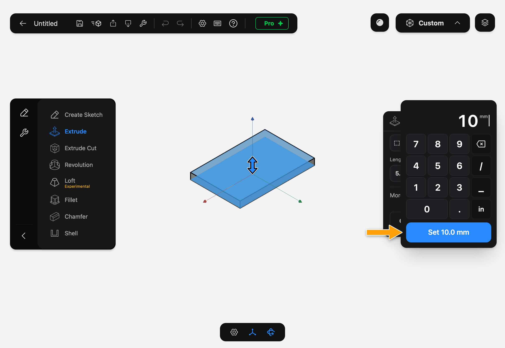

4. Tap **Apply**. The plate is rebuilt 10 mm thick, and the holes and rounded corners follow: the holes still go all the way through, and the fillets now run the full height.

   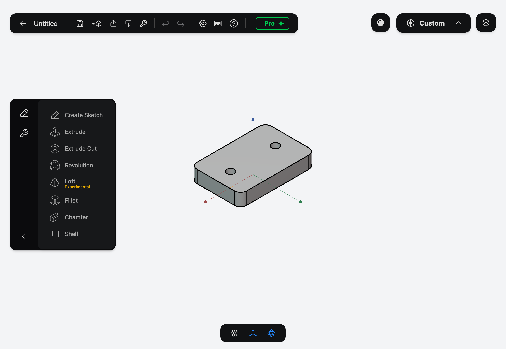

## 8. Export it as STL

1. In the toolbar at the top, tap the export button (the square with an arrow pointing up) to open **Export as...**.
2. Leave **All Solids** selected and tap **STL**.

   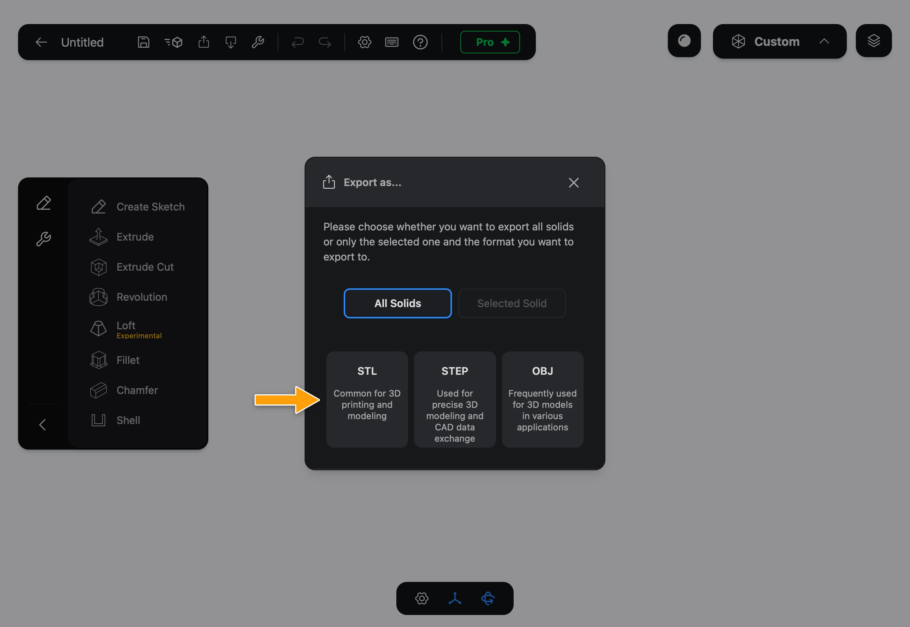

3. When the export finishes, the iPad share sheet opens. Tap **Save to Files** to keep the STL, or send it straight to another app. The file is named after the Document; tap **Untitled** in the toolbar to rename the Document before you export.

STL is free. **STEP** and **OBJ** need Pro, and with Pro the STL is exported at a finer resolution.

Your bracket is done. To keep working on it later, tap the save button (the floppy disk) in the toolbar.

## What's next

- The Concepts pages go deeper into Documents, Sketches, Constraints, Features, the History and planes.
- The Tool pages explain every option, starting with [Extrude](../../05-modeling/extrude/index.md).

> [!NOTE]
> **On Mac:** click wherever this page says tap, and draw with the mouse or trackpad instead of the Pencil. To turn the view, scroll with two fingers on the trackpad; to zoom, pinch or use the mouse wheel. There is no numpad: click a value, type the number and press Return. When you export, a save panel asks where to put the STL instead of the share sheet.
