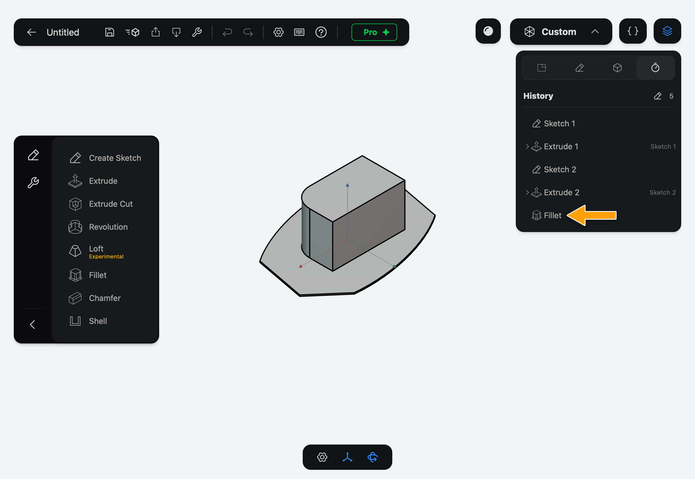
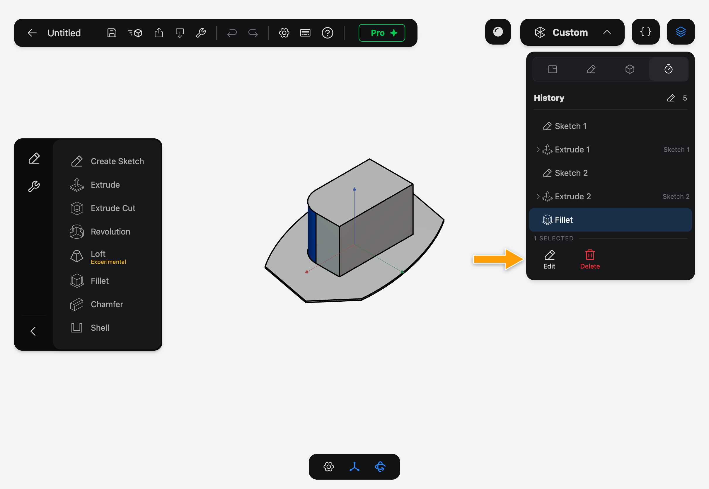
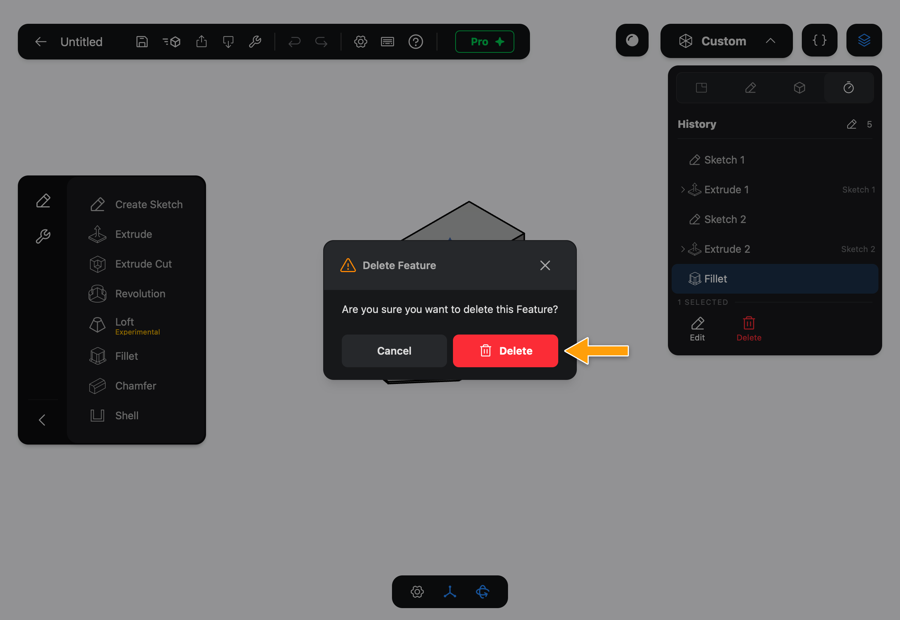

# Features and the History

A **Feature** is one modeling step: a Sketch, an Extrude, a Hole, a Fillet. Each Feature remembers its settings, such as a length or a radius, and can only use what the Features before it made.

The **History** is the ordered list of a Document's Features. Part3D builds your solids by replaying it from the top. Change an early Feature and everything after it is rebuilt on top of the change. That is what "parametric" means: your model is a recipe, not a lump of clay.

You don't have to read this page to use a Tool. But it's worth knowing how to change your mind after the fact.

## See the History

Tap the layers icon in the top-right corner, then the History tab (the timer icon). The Features are listed in the order you added them.

## Edit a Feature

1. In the History, tap the Feature.
2. In the bar that appears, tap **Edit**.

   

3. The Feature's panel opens with its settings, and the view shows the Document as it stood at that step. Change what you need, then tap **Apply**.

Every Feature after it is rebuilt. A later Feature that depended on something you changed may fail; open it and fix its settings.

## Delete a Feature

1. In the History, tap the Feature, then tap **Delete**.
2. The **Delete Feature** dialog asks you to confirm. Tap **Delete**, or **Cancel** to keep the Feature.

   

> [!WARNING]
> Deleting a Feature deletes only that one. The Features after it stay, and any that used it fail until you fix them. If you delete by mistake, tap **Undo** in the toolbar.

> [!TIP]
> To remove a whole solid at once instead, use **Delete** in the Solids tab. That adds a Delete Solid Feature to the History, so you can still undo it.

## What's next

- [Solids](../solids/index.md) are what Features build.
- [Extrude](../../05-modeling/extrude/index.md) is the most common first Feature.
