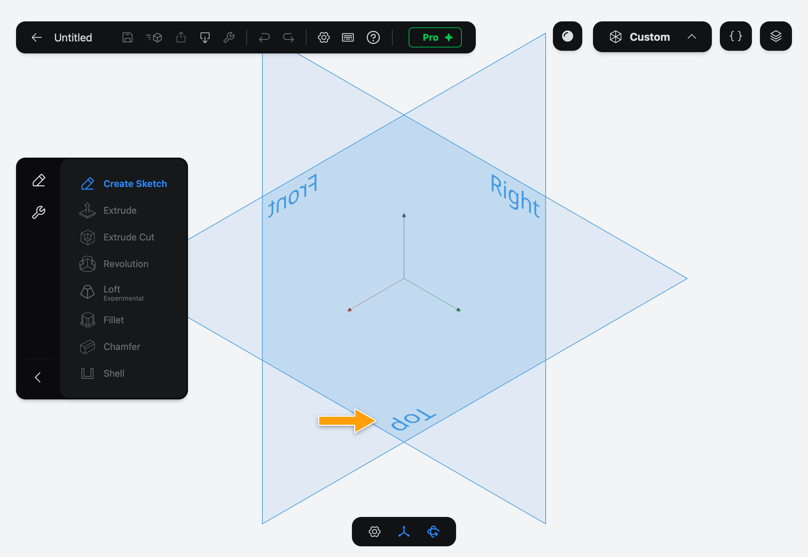
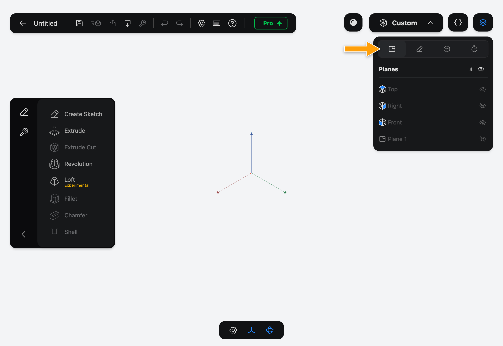

# Planes

A plane is an infinite flat surface that a [Sketch](../sketches/index.md) sits on. You don't draw on empty space in 3D: you pick a plane, then draw on it.

You don't have to read this page to start. It explains the three planes you meet first, and how to get more.

## Origin Planes

Every Document has three **Origin Planes**, all passing through the origin:

- **Top**: the flat one, like a table top.
- **Front**: the one facing you in the standard front view.
- **Right**: the one facing the right-hand side.

They appear when you tap **Create Sketch**. Tap one to start a Sketch on it.

You can also list them: tap the layers icon in the top-right corner, then the Planes tab.

## Construction Planes

When none of the Origin Planes or solid faces sits where you need a Sketch, add a **Construction Plane**. It is placed relative to an Origin Plane, another Construction Plane or a flat face: moved along it and turned. Sketches on a Construction Plane follow it if you change it later.

Construction Planes are listed in the Planes tab next to the Origin Planes.

## Flat faces

A flat face of a solid works like a plane too. Tap **Create Sketch**, then tap the face.

## What's next

- [Sketches](../sketches/index.md) covers what you can do once you're on a plane.
