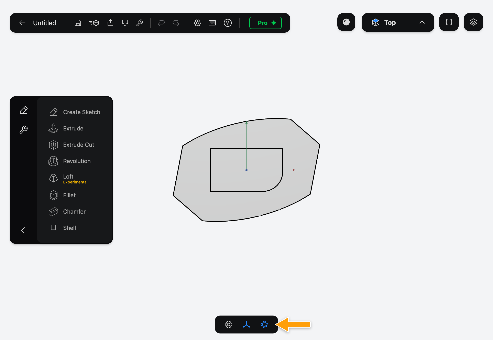
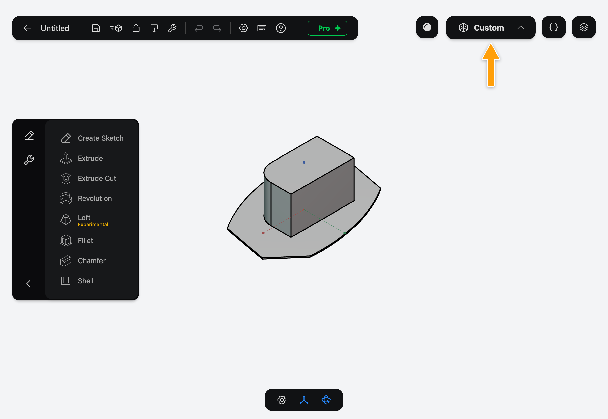
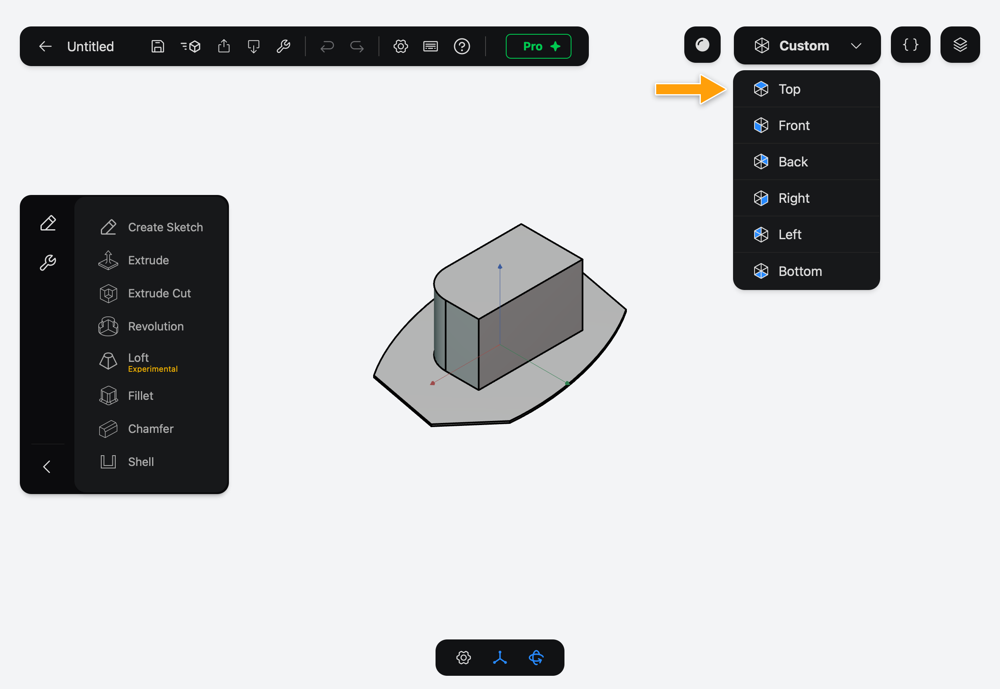
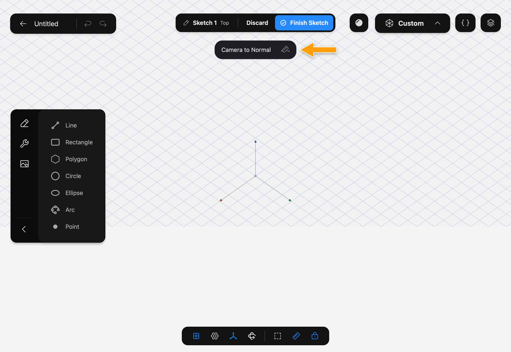
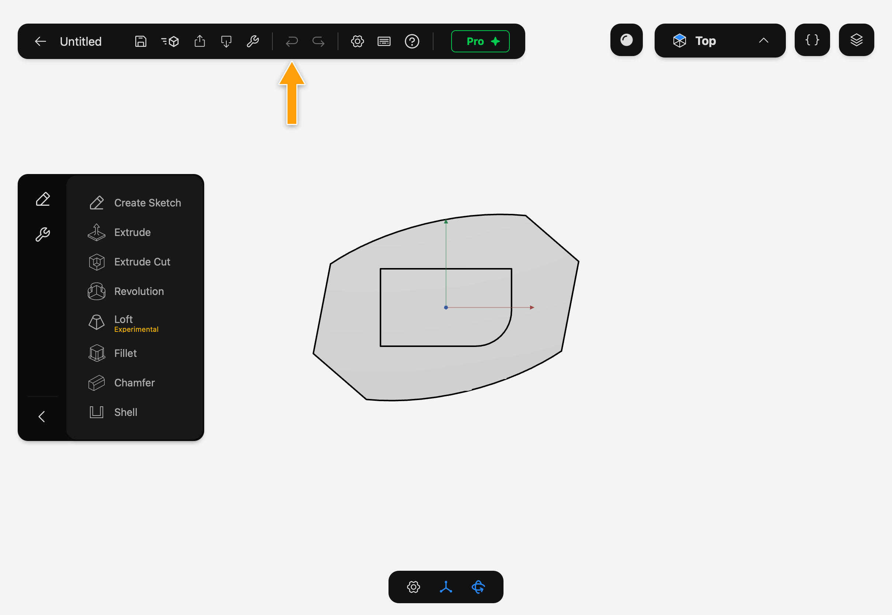
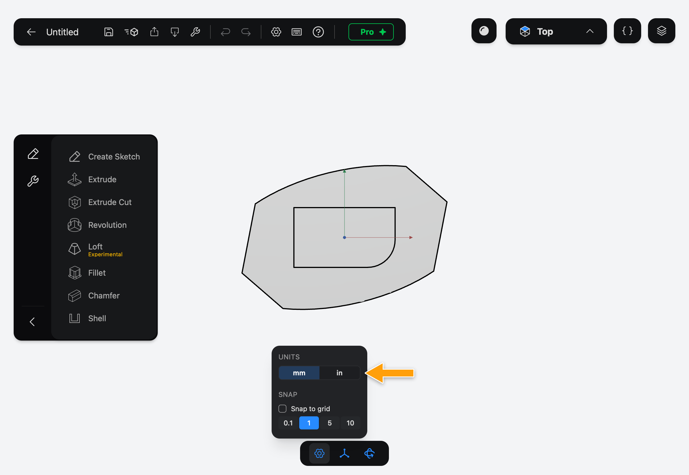

# Navigating

This page shows how to move around your model, and how to undo a mistake. Part3D on iPad is made for Apple Pencil: use the Pencil to draw and pick on the canvas, and your fingers to move the view.

## Turn, pan and zoom

- **Turn** (orbit) the view: drag with one finger.
- **Pan** the view: drag with two fingers.
- **Zoom**: pinch with two fingers.

> [!NOTE]
> **On Mac:** hold the right mouse button and drag to turn the view, hold the middle button and drag to pan, and use the mouse wheel to zoom. On a trackpad, scroll with two fingers to turn the view, hold **Shift** and scroll to pan, and pinch to zoom. The left mouse button never moves the view, so it is free for drawing and picking.

## Draw with the Pencil

In a sketch, the Pencil draws and picks; a finger only moves the view. As the Pencil touches down, Part3D snaps the point to nearby points, edges and the grid, and adds matching Constraints, such as a line ending on another line. The snap is worked out when you touch down and while you drag, so check the highlighted snap before you lift the Pencil.

> [!NOTE]
> **On Mac:** the mouse draws and snaps the same way the Pencil does.

## Lock Camera

A finger that brushes the screen can turn the view by accident, especially while you draw. Tap **Lock Camera** in the bar at the bottom of the screen to stop one-finger turning. Two fingers still pan and zoom. The button is now called **Unlock Camera**: tap it to turn the view with one finger again.

Part3D also locks the camera for you when you open a sketch, and when you tap **Camera to Normal**, so the sketch stays facing you. Picking a view from the view selector unlocks it.

> [!NOTE]
> **On Mac:** with the camera locked, trackpad scrolling pans and **Shift** with scrolling turns the view, the other way round from before.

## Go to a standard view

The view selector in the top-right corner shows the name of the current view: **Top**, **Front**, **Back**, **Right**, **Left**, **Bottom**, or **Custom** when you have turned the view to somewhere in between.

1. Tap the view selector to open the list.

   

2. Tap a view. The camera moves to look at your model from there.

   

The button next to the view selector, **Toggle Shaded with Edges**, switches whether solids are drawn with their edges outlined.

## Camera to Normal

When you are editing a sketch and the view is not looking straight at its plane, **Camera to Normal** appears at the top of the screen. Tap it to turn the camera so the sketch faces you again. The button disappears once you are looking straight at the sketch.

## Undo and redo

Tap the **Undo** arrow in the toolbar to take back your last change, and **Redo** to bring it back. While you edit a sketch, they undo and redo changes to the sketch. Otherwise they step back through the Document. An arrow is greyed out when there is nothing to undo or redo.

> [!NOTE]
> **On Mac:** press ⌘Z to undo and ⇧⌘Z to redo.

## Switch to inches

The examples in this manual use millimetres. To work in inches, tap the gear in the bar at the bottom of the screen (**Display & Units**) and pick **in** under **Units**. Use the same numbers, or convert them.

## What's next

- [Features and the History](../../02-concepts/features-and-history/index.md) explains how to change your model after you've built it.
- [Getting Started](../../01-getting-started/getting-started/index.md) puts all of this to use.
