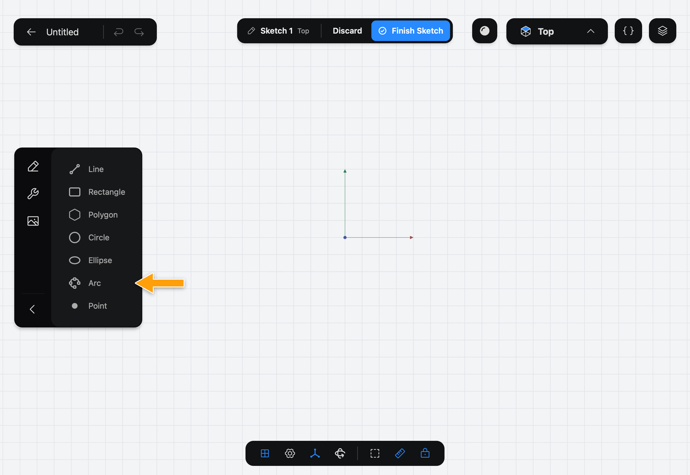
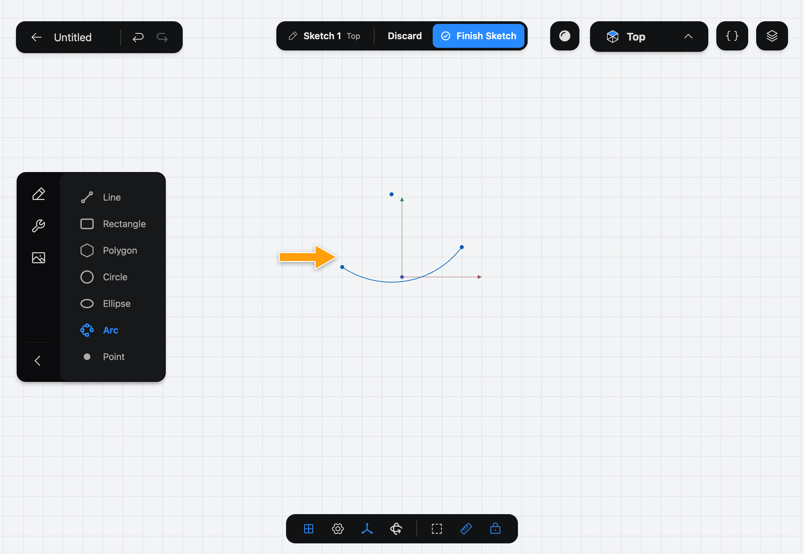

# Arc

Arc draws a curved segment of a circle between two end points. Part3D shows the arc's center point so you can constrain it.

## When to use it

Use Arc for rounded corners drawn by hand, curved slots and anything that bends but isn't a whole circle. For a whole circle, use [Circle](../circle/index.md). To round the corner of two lines, the Fillet (Sketch) Tool is quicker.

## Draw an arc

1. While you edit a sketch, tap **Arc** in the sidebar. If you don't see the drawing Tools, tap the pencil icon at the top of the sidebar.

   

2. With the Pencil, press where the arc starts, drag to where it ends, and lift. The arc curves gently to the right of the direction you dragged.

   

The curve is always a gentle bend, whatever the length. To reshape it, drag one of its points afterwards.

## Options

Arc has no options. The keyboard shortcut is **A**.

## Common problems

- **The arc bends the wrong way:** undo it and draw it from the other end, so the drag goes the opposite way.
- **It isn't as curved as I wanted:** drag one of the arc's points until it has the bend you want.
- **Nothing was drawn:** draw with the Pencil, not a finger.

> [!NOTE]
> **On Mac:** click and drag with the mouse instead of the Pencil, and press **A** to pick the Tool. Pressing the key again puts it away.
