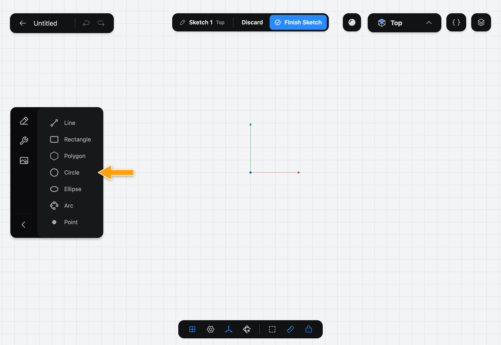
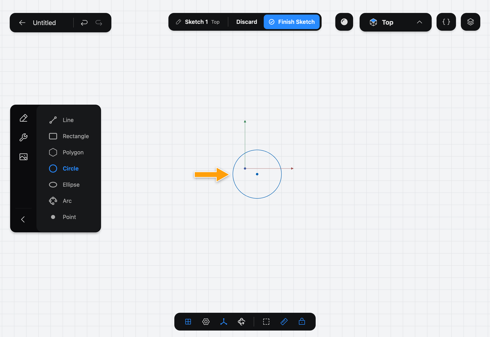

# Circle

Circle draws a circle. You set its center and its size with one stroke.

## When to use it

Use Circle for round bosses, round holes' outlines and washers. To place round holes in a solid, you can also use the Hole Tool on a face. For arcs of a circle, use [Arc](../arc/index.md).

## Draw a circle

1. While you edit a sketch, tap **Circle** in the sidebar. If you don't see the drawing Tools, tap the pencil icon at the top of the sidebar.

   

2. With the Pencil, press at the center, drag outward, and lift. The distance you dragged is the radius.

   

To set an exact size, tap the circle, tap **⋯**, pick **Diameter**, then tap the number and enter the value.

## Options

Circle has no options. The keyboard shortcut is **C**.

## Common problems

- **The circle isn't centered on the origin:** press on the origin when you start. The Pencil snaps to it.
- **Nothing was drawn:** draw with the Pencil, not a finger.
- **I want a circle to touch a line:** draw it roughly, then add a **Tangent** Constraint. See [Constraints](../../02-concepts/constraints/index.md).

> [!NOTE]
> **On Mac:** click and drag with the mouse instead of the Pencil, and press **C** to pick the Tool. Pressing the key again puts it away.
