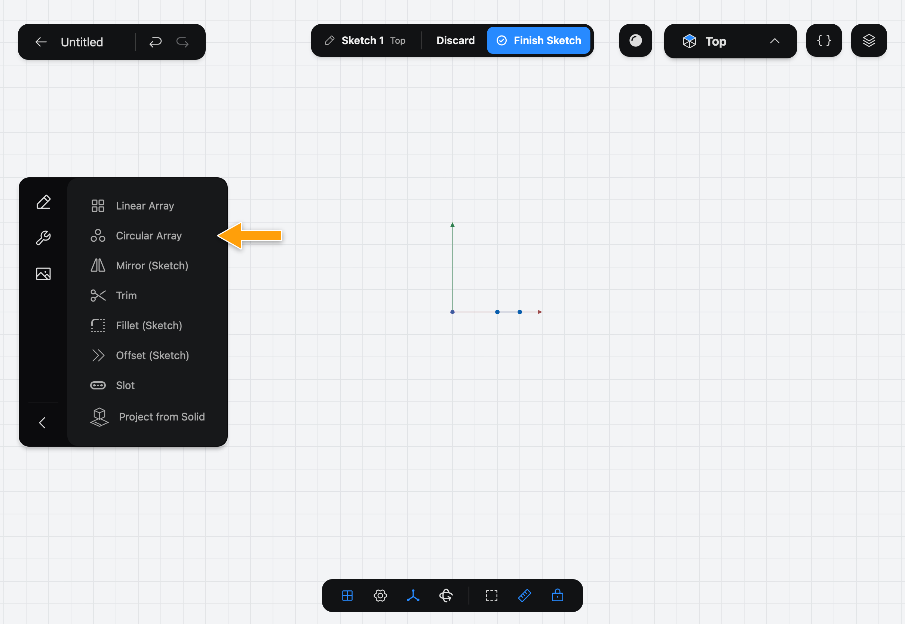
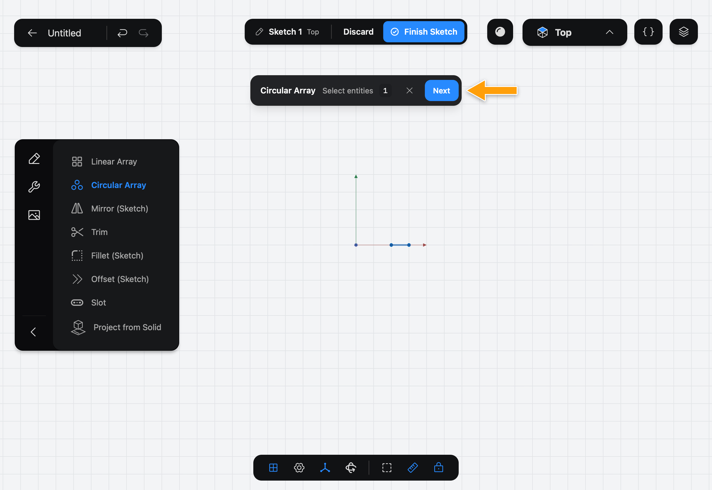
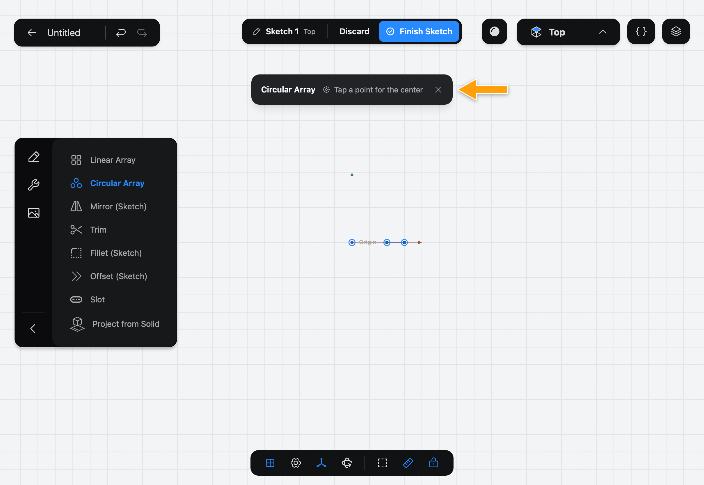
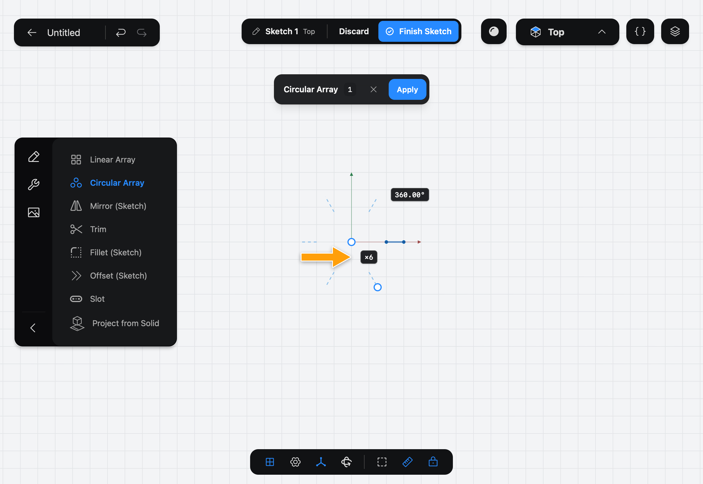
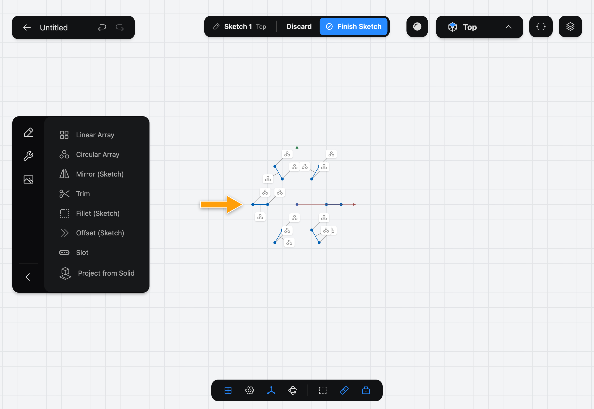

# Circular Array

Circular Array makes copies of shapes in a [Sketch](../../02-concepts/sketches/index.md) around a center point, like the bolts on a flange. The copies stay tied to the original.

## When to use it

Use Circular Array for a ring of holes, the spokes of a wheel or a gear's teeth. For a row of copies, use [Linear Array](../linear-array/index.md).

## Make a Circular Array

1. While you edit a sketch, tap the wrench icon at the top of the sidebar to show the sketch Tools, then tap **Circular Array**.

   

2. The step bar shows **Circular Array**, **Select entities**. Tap each shape to copy, then tap **Next**. If you picked them before opening the Tool, it skips this step.

   

3. The bar asks you to **Tap a point for the center**. Tap the point the copies turn around. Points you can pick show a ring; the origin is one of them.

   

4. The copies appear as a preview with two tags: how many there are (×6) and the angle they cover (360°). Tap a tag and enter a new value.

   

5. Tap **Apply**.

   

## Options

- **Count** is how many shapes there are, the original included. It starts at 6.
- **Angle** is how far round the copies go. At the full 360° they are spaced evenly all the way round. At a smaller angle they are spread from the original to the last copy across that angle.
- The handle at the center picks a different center. The handle on the other end of the arc changes the angle: drag it round the center.
- The **✕** in the bar cancels the Tool.

The copies are linked to the original by Constraints. To free a copy, select it, tap **⋯** and pick **Detach from Circular Array**.

## Common problems

- **Next stays greyed out:** pick at least one shape first.
- **The copies turn around the wrong point:** tap the center handle and tap another point, or tap **Keep Current** to leave it as it was.
- **I can't tap the point I want:** only points are offered as the center. Draw a [Point](../point/index.md) there first.

> [!NOTE]
> **On Mac:** click wherever this page says tap. To change a tag, click it and type the value; there is no numpad.
