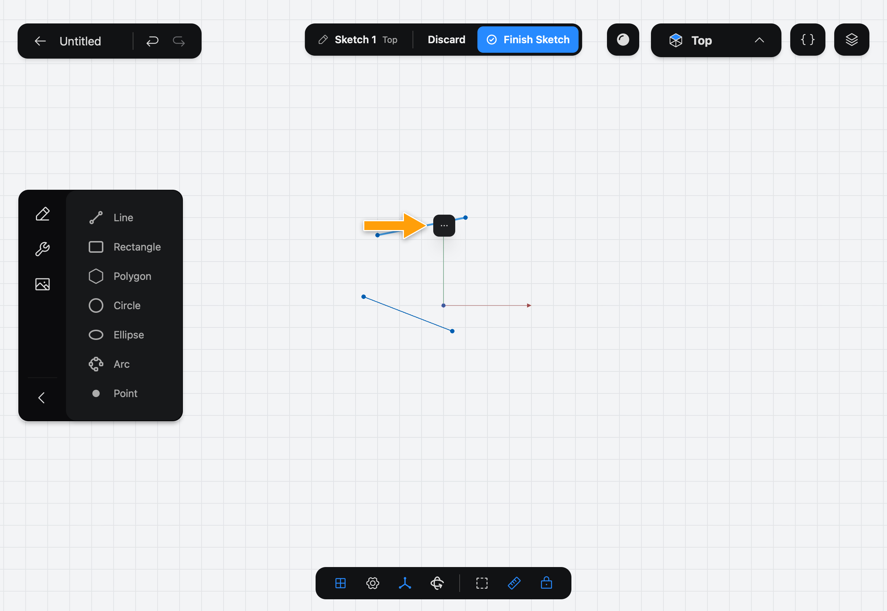
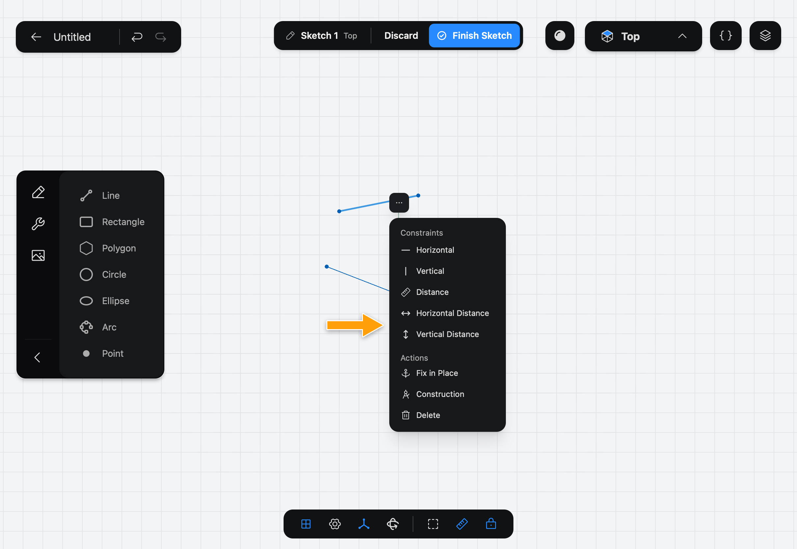
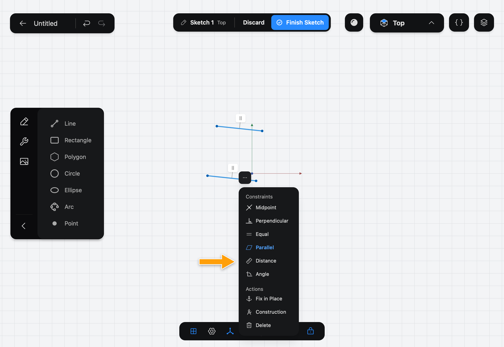
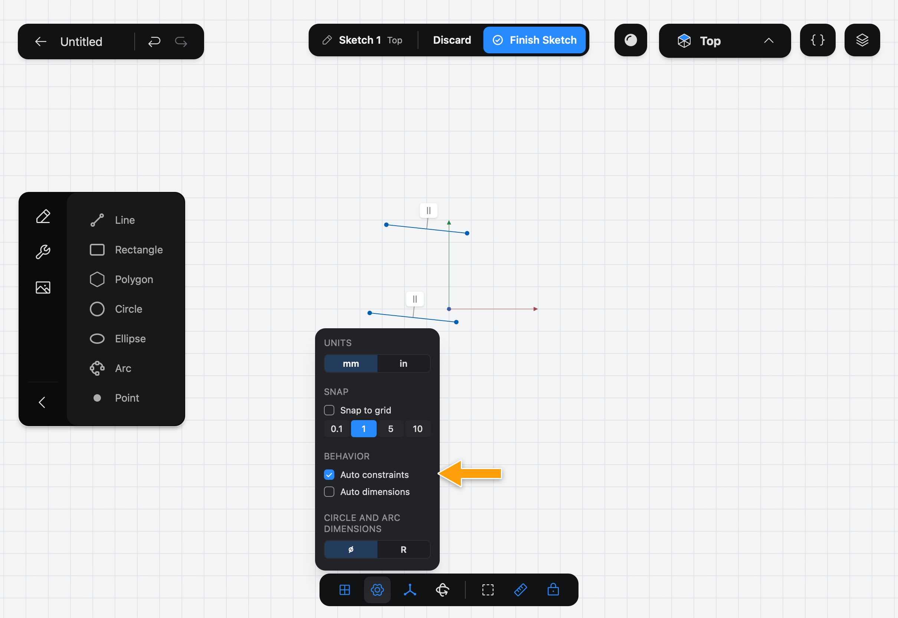
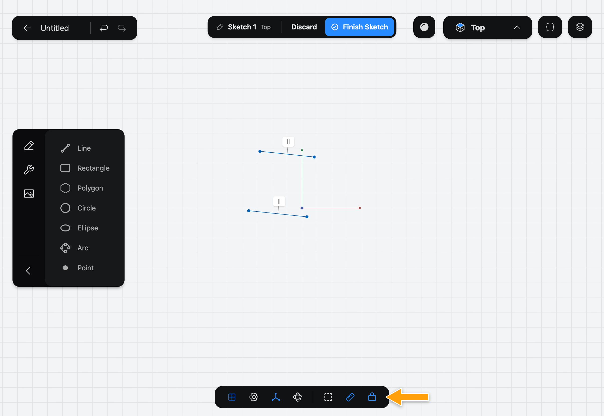

# Constraints

A **Constraint** is a rule a [Sketch](../../02-concepts/sketches/index.md) keeps true: "this line is horizontal", "these two lines are the same length", "this circle is 20 mm across". This page lists every Constraint Part3D offers, what to select to get it, and what it does. If you are new to the idea, read [Constraints](../../02-concepts/constraints/index.md) in Concepts first.

## Why Constraints matter

Lines drawn by hand are only close to what you meant. Constraints turn the drawing into a model:

- They make the shape exact: 60 mm means 60 mm, and a right angle is a right angle.
- They keep it that way. When you drag a corner or change a size, the rest of the Sketch moves to keep every rule true.
- They carry your intent into the History. Change a Constraint's value later and every Feature built on the Sketch is rebuilt.

## Add a Constraint

Part3D only offers the Constraints that make sense for what you have selected.

1. Select what the rule is about. Tap a line, a point, a circle or an arc. To add more, tap each one in turn; tap a selected item again to deselect it.
2. Tap the **⋯** button that appears next to the selection to open the **Constraints and Actions** menu. Its **Constraints** list changes with the selection.

   

   

3. Tap the Constraint. A rule that needs no number is applied at once. A size rule, such as **Distance**, **Angle**, **Diameter** or **Radius**, shows its value: tap the number to open the numpad and enter the value you want.

Select two lines instead of one and the list changes to the rules that relate them:

Applying a Constraint clears the selection. Select the same things again and the menu marks the Constraints already applied, in blue. Tap a marked Constraint to remove it.

> [!NOTE]
> **On Mac:** click wherever this page says tap. To add to a selection, click each item in turn.

## All Constraints

| Constraint | What to select | What it does |
| --- | --- | --- |
| **Horizontal** | One line, or two points | Keeps the line level, or the two points at the same height. |
| **Vertical** | One line, or two points | Keeps the line plumb, or the two points one above the other. |
| **Distance** | One line, two points, a point and a line, two parallel lines, or two curves | Sets a length: the line's length, the gap between two points, the distance from a point to a line or between two parallel lines, or the gap between an arc and an arc or circle. |
| **Horizontal Distance** | Two points, or one line | Sets how far apart they are along the horizontal axis only. |
| **Vertical Distance** | Two points, or one line | Sets how far apart they are along the vertical axis only. |
| **Angle** | Two lines | Sets the angle between them. |
| **Diameter** | One circle | Sets the circle's size. |
| **Radius** | One arc | Sets the arc's radius. |
| **Coincident** | Two points | Joins them into one point. |
| **Point On** | A point and a line, circle, arc or ellipse | Keeps the point on the curve. |
| **Midpoint** | A point and a line, or two lines | With a point: keeps the point at the middle of the line. With two lines: keeps the middle of the first line you selected on the second line. |
| **Parallel** | Two lines | Keeps them pointing the same way. |
| **Perpendicular** | Two lines | Keeps them at a right angle. |
| **Equal** | Two or more lines, two arcs, or circles and arcs | Makes them the same length, or the same radius. |
| **Tangent** | A line and a circle, arc or ellipse; or two arcs or circles | Makes them touch smoothly, without a corner. |

The **Actions** list below the Constraints holds three more entries for any selection:

- **Fix in Place** locks the selection where it is.
- **Construction** turns it into construction geometry, which guides the drawing but is not part of the outline you extrude.
- **Delete** removes the selection.

## Direction: Horizontal and Vertical

Horizontal and Vertical keep a line level or plumb. Part3D adds them for you when you draw a rectangle, and when a line you draw is close to level or plumb. Two selected points can be held horizontal or vertical to each other too, which is how you line up two holes without drawing a line between them.

## Size: Distance, Angle, Diameter and Radius

These rules hold a measurement. They show the current value, and you tap it to change it.

- **Distance** depends on what you selected: a line gives its length, two points give the gap between them, a point and a line give the shortest distance from one to the other, and two parallel lines give the gap between them.
- **Horizontal Distance** and **Vertical Distance** measure along one axis only. They are not offered for a line that is already held horizontal or vertical, because **Distance** then measures the same thing.
- **Angle** needs two lines.
- **Diameter** and **Radius** size a circle or an arc. Whether a circle or arc shows its size as a diameter (⌀) or a radius (R) is a setting, not part of the Document: change it in the settings menu in the bar at the bottom of the screen, under **Circle and arc dimensions**.

## Joining: Coincident, Point On and Midpoint

- **Coincident** merges two points, so that lines meeting at them stay connected.
- **Point On** keeps a point on a line, circle, arc or ellipse, so it can slide along it but not leave it.
- **Midpoint** pins a point to the middle of a line.

## Relating shapes: Parallel, Perpendicular, Equal and Tangent

- **Parallel** and **Perpendicular** relate the directions of two lines. Once two lines are parallel, **Distance** is offered for the gap between them.
- **Equal** matches lengths or radii. Select three or more lines and they all become the same length.
- **Tangent** blends a line into a curve, or one curve into another, with no kink. It is what gives a rounded slot its smooth sides.

## Auto constraints and Auto dimensions

Part3D can add Constraints while you draw:

- **Auto constraints** is on by default. When a point lands on another point, on a line or on the origin, Part3D joins them, and a line that is nearly level or plumb is made so. Turn it off if it joins things you wanted left apart.
- **Auto dimensions** is off by default. When it is on, the Tools also add a size Constraint for the shape you draw, such as a line's length or a circle's diameter, so it starts with a number you can tap to change.

Both are in the settings menu in the bar at the bottom of the screen, under **Behavior**, while you edit a sketch.

## Show and hide Constraints

The small badges on the sketch are its Constraints, and the sizes drawn on it are its dimensions. If they crowd the drawing, use **Hide Constraints** and **Hide Dimensions** in the bar at the bottom of the screen. The buttons change to **Show Constraints** and **Show Dimensions**. Hiding them only changes what you see; the rules still apply.

## When Constraints go wrong

**Constraints that conflict.** If a rule can't be true together with the others, Part3D tells you: **Cannot add constraint: it would cause a conflict.** Or, after a change: **Solver failed to converge. Constraints may be conflicting.** Remove one of the rules involved. Tap a marked Constraint in the menu to remove it, or select the badge's geometry and open the menu.

**The Constraints Deleted warning.** A Sketch that sits on a face or a Construction Plane follows it when the model changes. If a change removes something a rule depended on, such as an edge that no longer exists, Part3D deletes that rule and opens a **Constraints Deleted** dialog. It says how many were deleted and lists them. Tap **Ok** to continue. The geometry stays where it was, but it is no longer held by those rules: open the Sketch and add the Constraints again.

> [!WARNING]
> Changing an earlier Feature, or the face or plane a Sketch sits on, can delete Constraints in the Sketches that follow it. Check the Sketch after such a change.

## What's next

- [Getting Started](../../01-getting-started/getting-started/index.md) uses **Distance** to size the bracket.
- [Line](../line/index.md), [Rectangle](../rectangle/index.md) and [Circle](../circle/index.md) show the Constraints each Tool adds for you.
