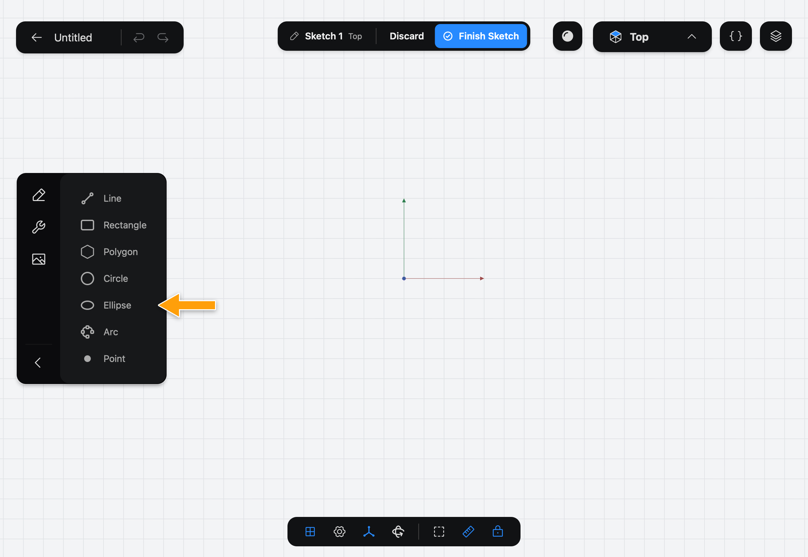
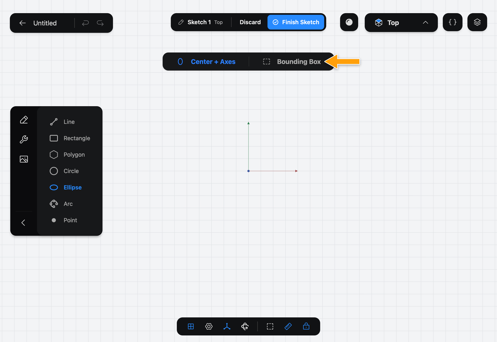
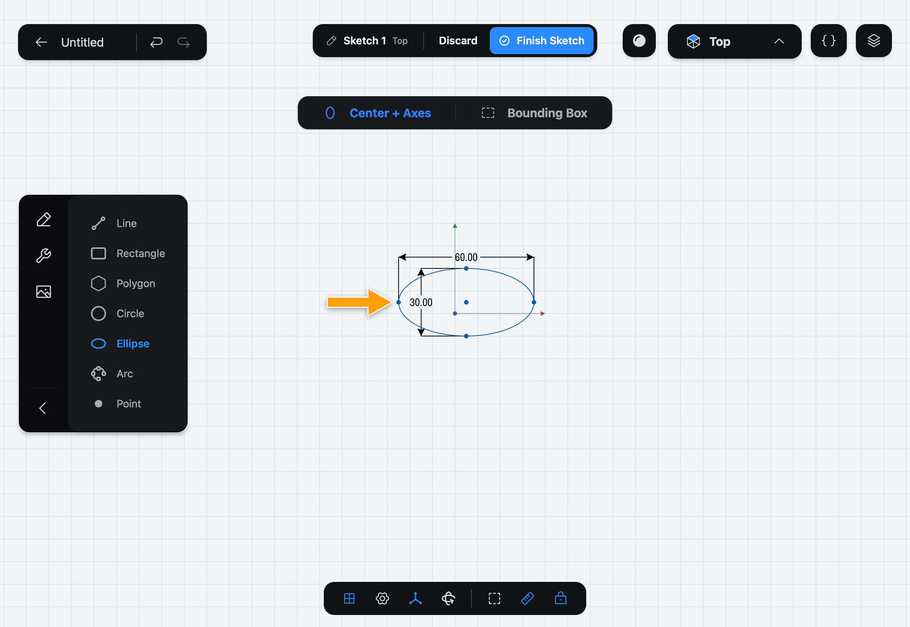

# Ellipse

Ellipse draws an oval with a long axis and a short axis. Part3D adds a dimension for each axis so you can set them exactly.

## When to use it

Use Ellipse for oval openings, oblong bosses and elliptical sections. For a circle, use [Circle](../circle/index.md).

## Draw an ellipse

1. While you edit a sketch, tap **Ellipse** in the sidebar. If you don't see the drawing Tools, tap the pencil icon at the top of the sidebar.

   

2. The options bar shows **Center + Axes** and **Bounding Box**. **Center + Axes** is selected.

   

3. With the Pencil, press at the center, drag along the long axis, and lift. The short axis starts at half the long one.

   

The two dimensions show the width and height of the ellipse. Tap one and enter a value to change the shape.

## Options

- **Center + Axes**: the point where you press is the middle, and the point where you lift is the end of the long axis. The direction you drag sets how the ellipse is turned.
- **Bounding Box**: the points where you press and lift are opposite corners of a box, and the ellipse fits inside it.

The keyboard shortcut is **E**.

## Common problems

- **The ellipse is too round or too thin:** its short axis starts at half the long axis. Set the dimension of the axis you want to change.
- **It's turned the wrong way:** with **Center + Axes**, drag along the direction you want the long axis to point. With **Bounding Box**, the ellipse follows the box's sides.
- **Nothing was drawn:** draw with the Pencil, not a finger.

> [!NOTE]
> **On Mac:** click and drag with the mouse instead of the Pencil, and press **E** to pick the Tool. Pressing the key again puts it away.
