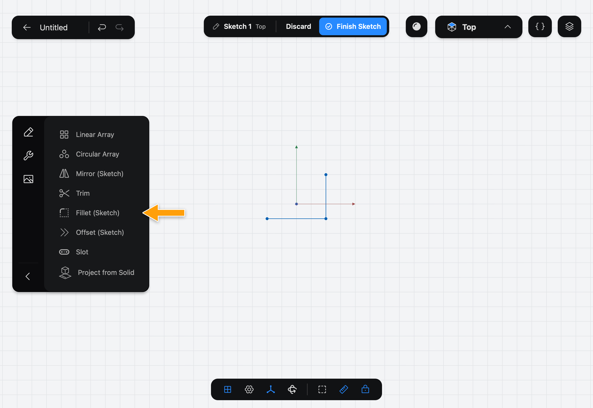
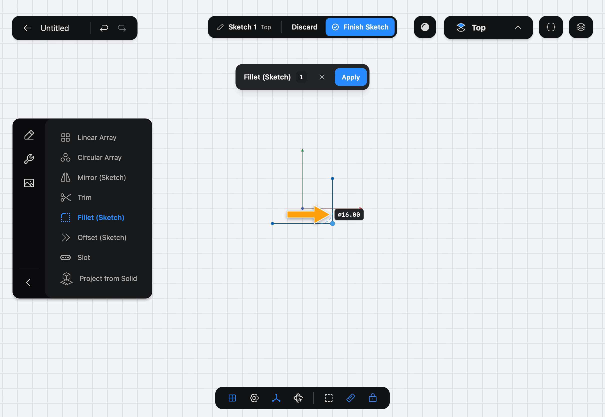
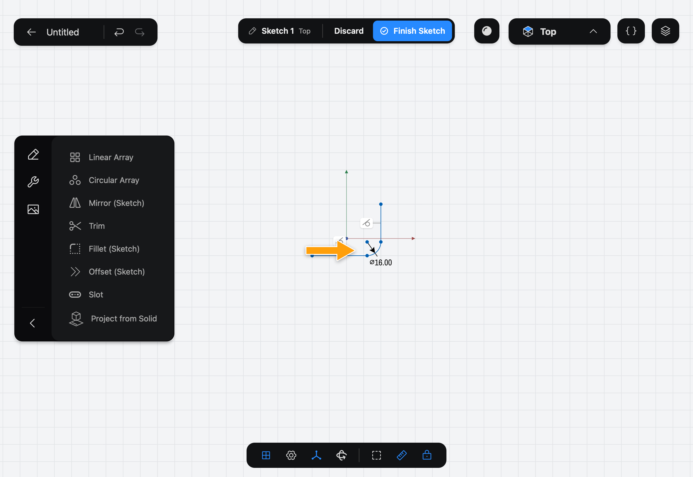

# Fillet (Sketch)

Fillet (Sketch) rounds a corner where two lines meet in a [Sketch](../../02-concepts/sketches/index.md), replacing the sharp point with an arc.

> Rounding edges of a solid? See Fillet.

## When to use it

Use Fillet (Sketch) to round the corners of an outline before you [Extrude](../../05-modeling/extrude/index.md) it. The rounded corner becomes a curved wall on the solid. To round an edge of a solid you have already made, use Fillet.

## Round a corner

1. While you edit a sketch, tap the wrench icon at the top of the sidebar to show the sketch Tools, then tap **Fillet (Sketch)**.

   

2. The step bar shows **Fillet (Sketch)**, **Tap corners to round**. Tap a corner, the point where two lines meet. Tap more corners to round them all at once. The tag next to the corner shows the size.

   

3. Tap the tag and enter the size you want.

   

4. Tap **Apply**. The arc replaces the corner.

   

## Options

- **Size** is shown the way your sketch shows circles: as a diameter (⌀) or as a radius (R). Change it with **Circle and arc dimensions** in the settings menu in the bar at the bottom of the screen. Enter the number in the form the tag shows. It starts at a fifth of the shorter of the two lines (as a radius).
- When you pick several corners they share one size.
- The **✕** in the bar cancels the Tool.

The size stays on the Sketch as a dimension, such as **⌀16.00**. Tap it later to change the fillet. One **Undo** takes back the whole fillet, every corner included.

## Common problems

- **Apply is greyed out and the bar says the size is too large:** the arc won't fit on the lines. Enter a smaller size. A message says **The radius is too large for a corner's lines.**
- **A message says "Fillet requires exactly 2 lines meeting at the selected point":** you tapped a point where something other than two lines meets. Pick a corner of two lines.
- **Nothing happens when I tap a line:** only corners can be picked. Tap the point where the lines meet.
- **The lines are nearly parallel:** a fillet can't be made. Straighten them or change the angle first.

> [!NOTE]
> **On Mac:** click wherever this page says tap.
