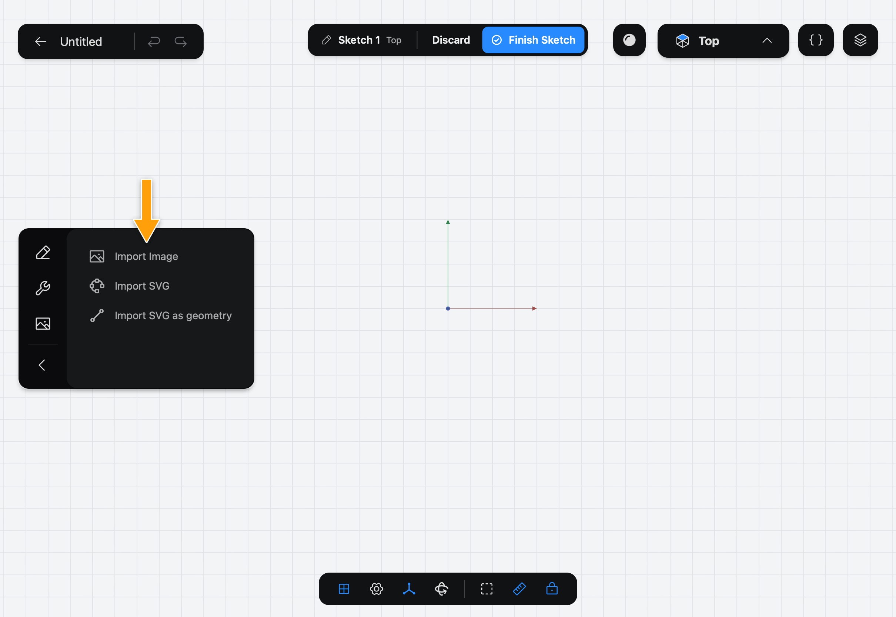
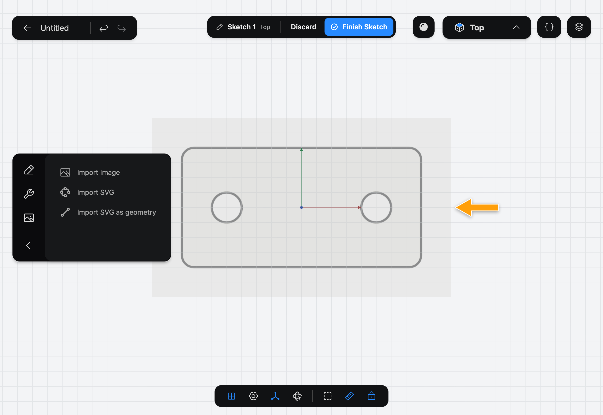
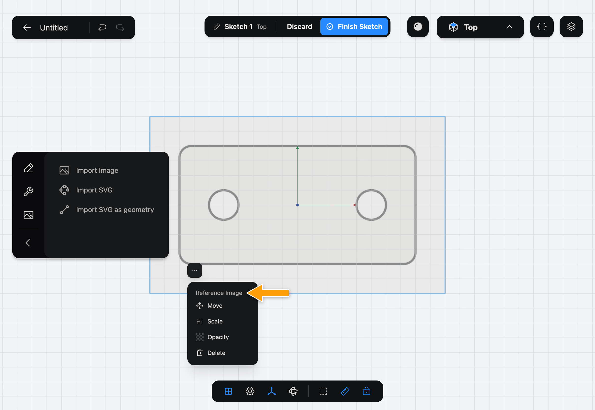
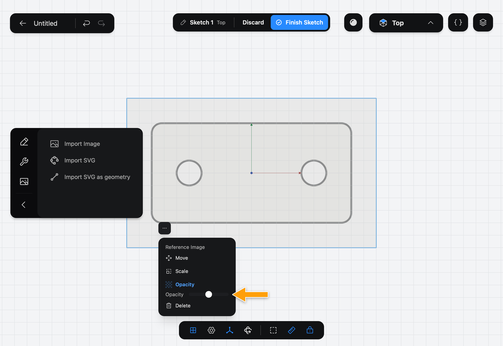

# Import Image

> [!IMPORTANT]
> **Pro:** Import Image is part of Part3D Pro.

Import Image puts a photo, a scan or a drawing behind your [Sketch](../../02-concepts/sketches/index.md), so you can trace its outline with the drawing Tools. The image is a guide only: it is saved with the Sketch, but it is not part of its outline, and it is never turned into a solid.

## When to use it

Use Import Image to copy a part from a photo or a hand drawing: lay the picture down, scale it to the right size, then draw over it with [Line](../line/index.md), [Rectangle](../rectangle/index.md) and the other Tools. For an SVG file, use [Import SVG](../import-svg/index.md), which keeps its lines sharp, or [Import SVG as geometry](../import-svg-as-geometry/index.md) to turn it into lines and circles.

## Import an image

1. While you edit a sketch, tap the picture icon at the bottom of the sidebar's icon column (**Reference Images**) to show the import Tools, then tap **Import Image**.

   

2. The system file picker opens. Choose a PNG, JPG or WebP file. If you change your mind, cancel the picker and nothing is added.

3. The image appears on the Sketch, centered on the origin and half see-through. Its longer side is 200 mm.

   

4. To adjust it, tap the image to select it, then tap the **⋯** button. The **Reference Image** menu opens with **Move**, **Scale**, **Opacity** and **Delete**.

   

## Move, scale and fade the image

- **Move**: tap it, then drag the image.
- **Scale**: tap it, then drag the image away from its center to make it bigger, or toward its center to make it smaller. Drag until a feature of the picture matches a size you know, such as a hole's diameter.
- **Opacity**: tap it, then use the slider to fade the image more or less.

Tap a mode again to switch it off, so a drag on the image no longer moves it. **Delete** removes the image from the Sketch. **Undo** takes back a move or a scale.

## Options

- **Move**, **Scale** and **Opacity** are described above. A new image starts at half opacity.
- **Delete** removes the image.

## Common problems

- **Nothing was added:** the file picker was cancelled, or the file isn't a PNG, JPG or WebP image.
- **The image is the wrong size:** use **Scale**. Check the size against a dimension on the Sketch.
- **I can't select the image:** tap a part of the image away from any lines you have drawn, then tap **⋯**.
- **The image gets in the way:** lower its **Opacity**, or delete it once you have traced it.

> [!NOTE]
> **On Mac:** click wherever this page says tap. The file picker is the standard Open panel.
