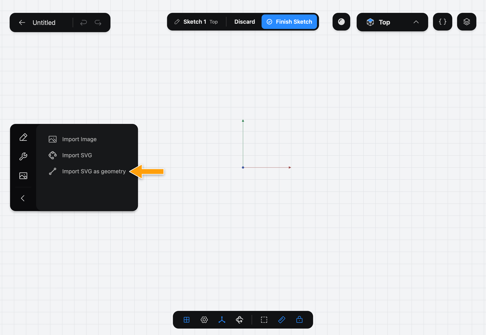
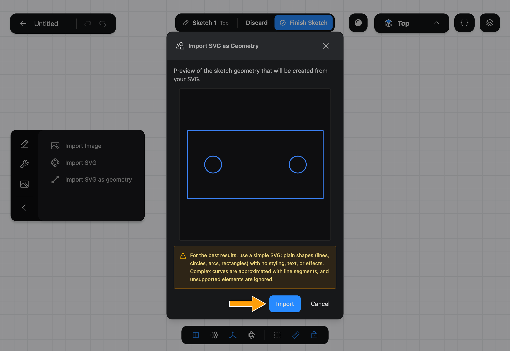
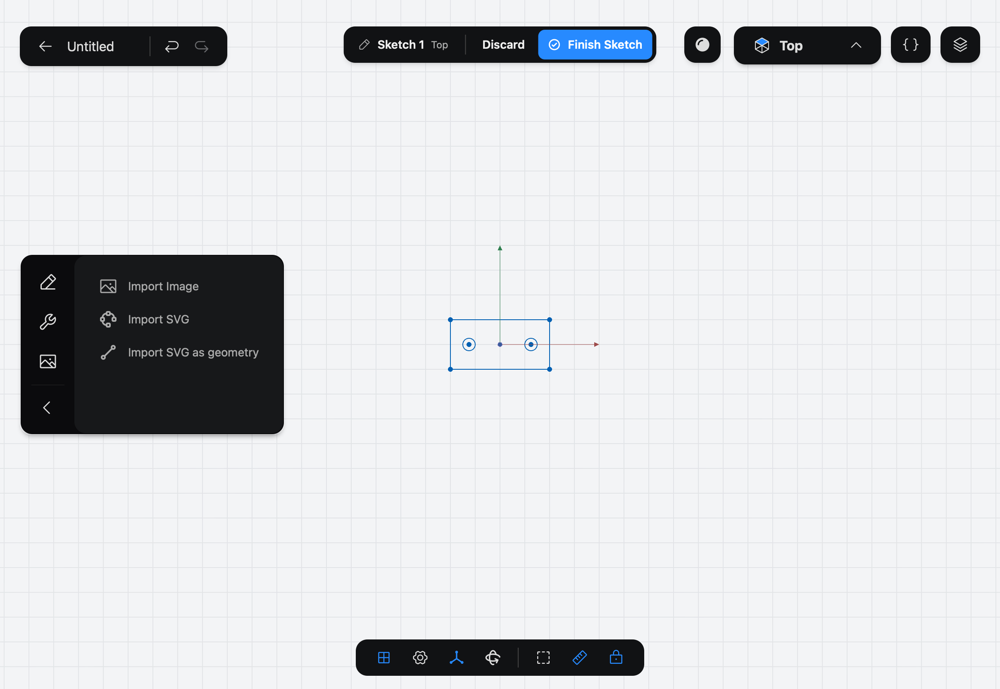

# Import SVG as geometry

Import SVG as geometry reads an SVG file and adds its shapes to your [Sketch](../../02-concepts/sketches/index.md) as real geometry: lines, circles and arcs that you can select, constrain and extrude like ones you drew yourself.

## When to use it

Use it to bring in an outline made elsewhere: a logo, a laser-cut profile, a drawing from a vector program. For a drawing you only want to trace, use [Import SVG](../import-svg/index.md) instead.

## Import an SVG as geometry

1. While you edit a sketch, tap the picture icon at the bottom of the sidebar's icon column (**Reference Images**) to show the import Tools, then tap **Import SVG as geometry**.

   

2. The system file picker opens. Choose an SVG file. If you cancel, nothing is added.

3. The **Import SVG as Geometry** dialog shows a preview of the geometry that will be created. Check that it looks right, then tap **Import**. Tap **Cancel** to leave without adding anything.

   

4. The shapes are added to the Sketch.

   

## Options

The dialog has no options: it shows the preview, a note about what works best, and the **Import** and **Cancel** buttons.

For the best result, use a simple SVG made of plain shapes: lines, circles, arcs and rectangles, with no styling, text or effects. Complex curves are approximated with short line segments, and anything Part3D doesn't support is ignored.

The shapes come in with no Constraints, and the size they come in at depends on the SVG's own units. Check it, and use [Constraints](../constraints/index.md), such as **Distance**, to put the shapes at the size you need.

## Common problems

- **The dialog says no importable geometry was found:** the SVG has nothing Part3D can read, such as only text or images. Try a simpler file.
- **The shapes are the wrong size:** set the size with a Constraint, or select everything and rescale it in the program that made the SVG, then import again.
- **A curve looks faceted:** complex curves are approximated with line segments. Redraw it with an [Arc](../arc/index.md) or a [Circle](../circle/index.md).
- **Nothing was added:** the file picker was cancelled, or you tapped **Cancel**.

> [!NOTE]
> **On Mac:** click wherever this page says tap. The file picker is the standard Open panel.
