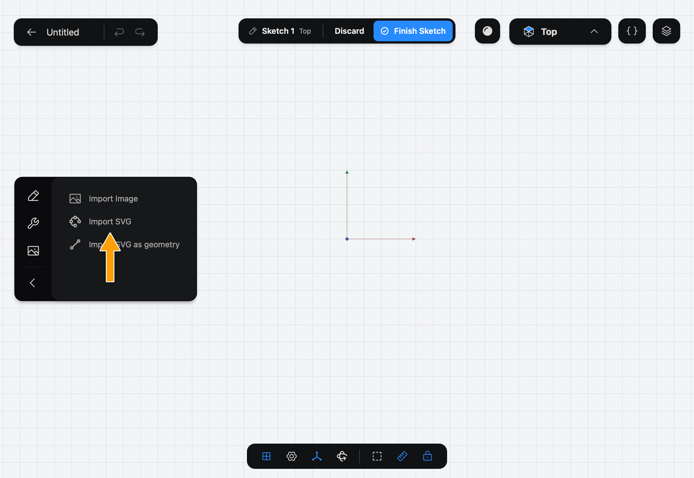
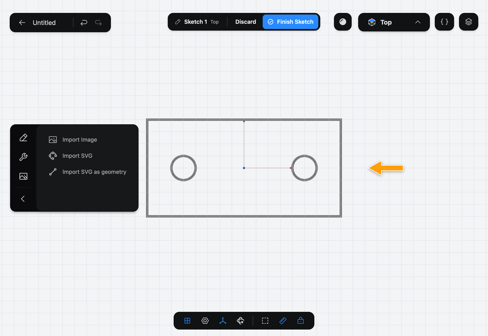
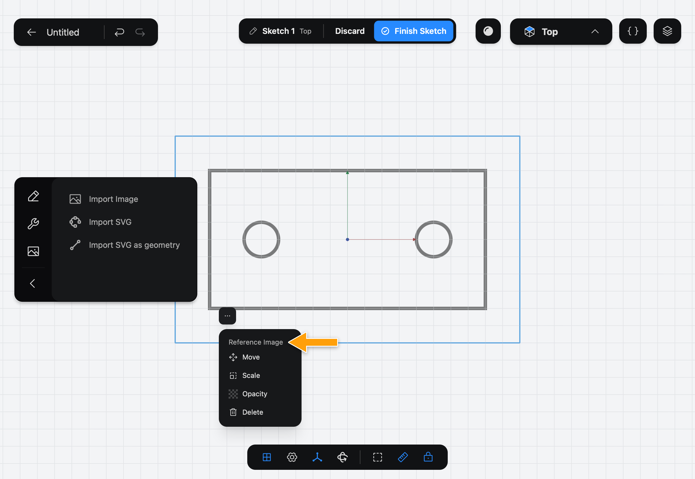

# Import SVG

> [!IMPORTANT]
> **Pro:** Import SVG is part of Part3D Pro.

Import SVG puts a vector drawing (an SVG file) behind your [Sketch](../../02-concepts/sketches/index.md) as a guide to trace. Unlike [Import Image](../import-image/index.md), the drawing stays sharp however far you zoom in. Like it, the drawing is only a guide: it is not part of the Sketch's outline.

## When to use it

Use Import SVG when your reference is a vector file, such as a logo or a technical drawing, and you want to trace it by hand. To turn the SVG's lines and circles into real Sketch geometry instead, use [Import SVG as geometry](../import-svg-as-geometry/index.md).

## Import an SVG

1. While you edit a sketch, tap the picture icon at the bottom of the sidebar's icon column (**Reference Images**) to show the import Tools, then tap **Import SVG**.

   

2. The system file picker opens. Choose an SVG file. If you cancel, nothing is added.

3. The drawing appears on the Sketch, centered on the origin and half see-through. Its longer side is 200 mm.

   

4. To adjust it, tap the drawing to select it, then tap the **⋯** button. The **Reference Image** menu opens with **Move**, **Scale**, **Opacity** and **Delete**, which work as they do for an image.

   

## Options

- **Move**: tap it, then drag the drawing.
- **Scale**: tap it, then drag the drawing away from its center to make it bigger, or toward its center to make it smaller.
- **Opacity**: tap it, then use the slider.
- **Delete** removes the drawing.

## Common problems

- **Nothing was added:** the file picker was cancelled, or the file isn't a valid SVG.
- **The drawing is the wrong size:** use **Scale**, and compare a feature with a dimension on the Sketch.
- **I want to edit the lines:** an imported SVG is a guide and can't be edited. Use [Import SVG as geometry](../import-svg-as-geometry/index.md) to get lines and circles you can change.

> [!NOTE]
> **On Mac:** click wherever this page says tap. The file picker is the standard Open panel.
