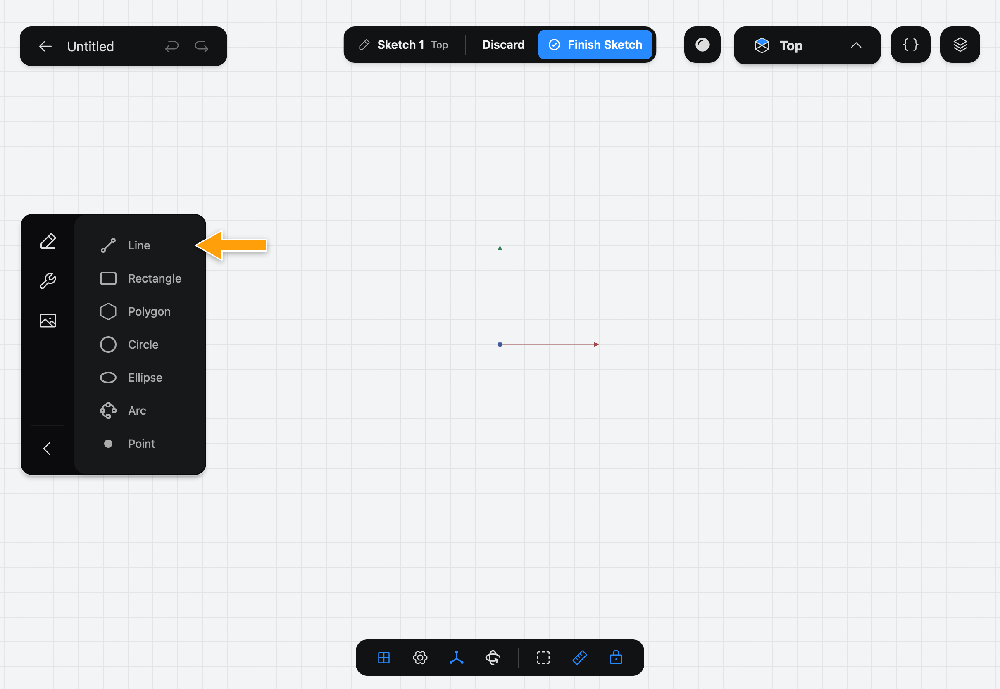
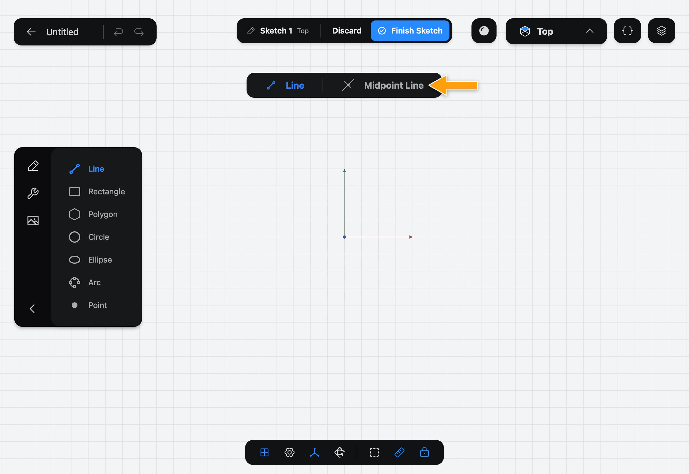
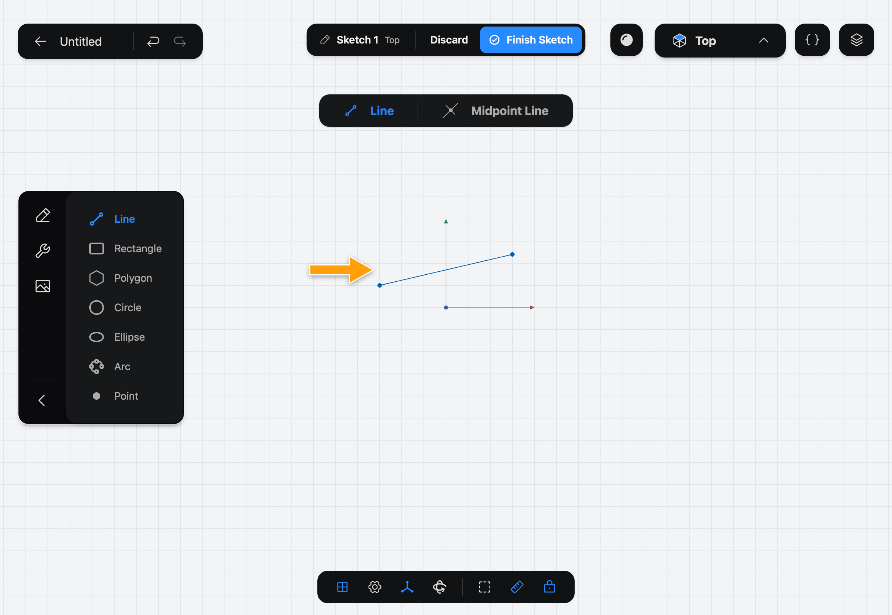

# Line

Line draws one straight segment in a [Sketch](../../02-concepts/sketches/index.md). Draw several that meet end to end and they make an outline you can turn into a solid.

## When to use it

Use Line for straight edges: the sides of a bracket, a slot's walls, a guide for something else. For a four-sided box, [Rectangle](../rectangle/index.md) is faster. For curves, use [Arc](../arc/index.md) or [Circle](../circle/index.md).

## Draw a line

1. While you edit a sketch, tap **Line** in the sidebar. If you don't see the drawing Tools, tap the pencil icon at the top of the sidebar.

   

2. The options bar appears at the top of the canvas with **Line** and **Midpoint Line**. **Line** is selected.

   

3. With the Pencil, press where the line starts, drag, and lift where it ends. The line shows its length while you drag.

   

Each stroke draws one line. To draw an outline, start each new line on the end of the last one: the Pencil snaps to the endpoint and joins the two.

> [!TIP]
> Draw a line that is close to horizontal or vertical and Part3D snaps it and adds a **Horizontal** or **Vertical** Constraint for you. See [Constraints](../../02-concepts/constraints/index.md).

## Options

- **Line**: the point where you press is one end, and the point where you lift is the other.
- **Midpoint Line**: the point where you press is the middle of the line. Dragging out to one side draws the same distance on the other, so the line grows both ways from where you started.

The keyboard shortcut is **L**.

## Common problems

- **Nothing was drawn:** the stroke was too short, or you drew with a finger. A finger only turns the view; draw with the Pencil. See [Navigating](../../03-navigating/navigating/index.md).
- **The lines don't form a closed outline:** the ends don't meet. Start the next line on the end of the last one, so it snaps and joins.
- **A line isn't exactly the length you wanted:** draw it roughly, then set its length with a Constraint, as in [Getting Started](../../01-getting-started/getting-started/index.md).

> [!NOTE]
> **On Mac:** click and drag with the mouse instead of the Pencil, and press **L** to pick the Tool. Pressing the key again puts it away.
