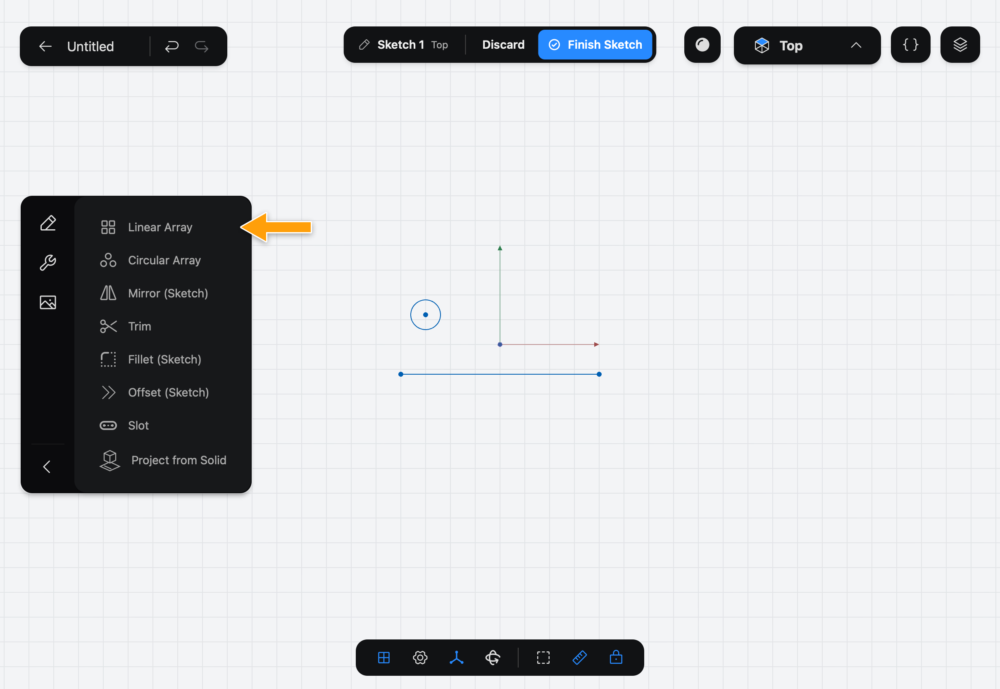
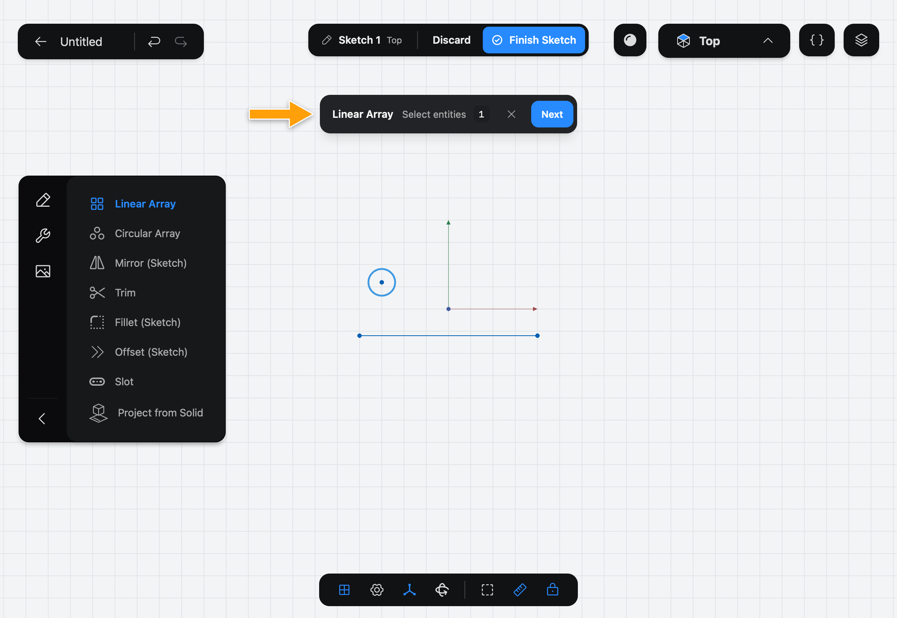
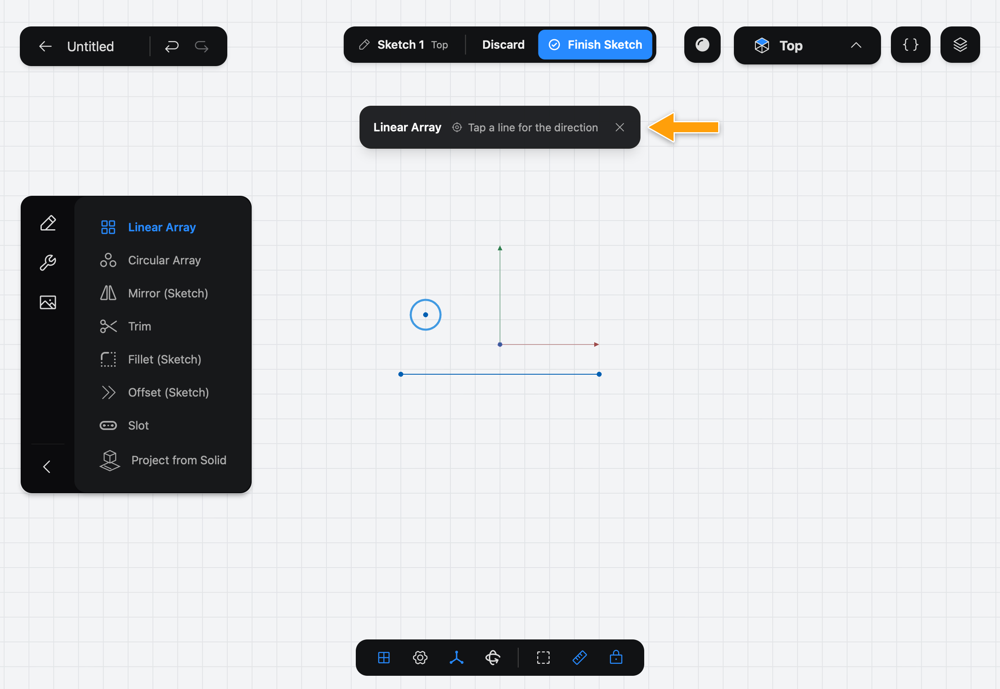
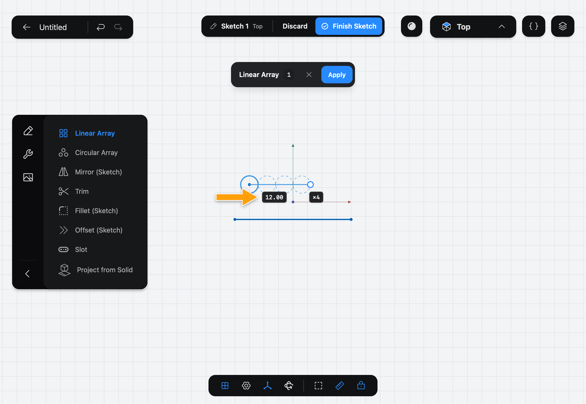
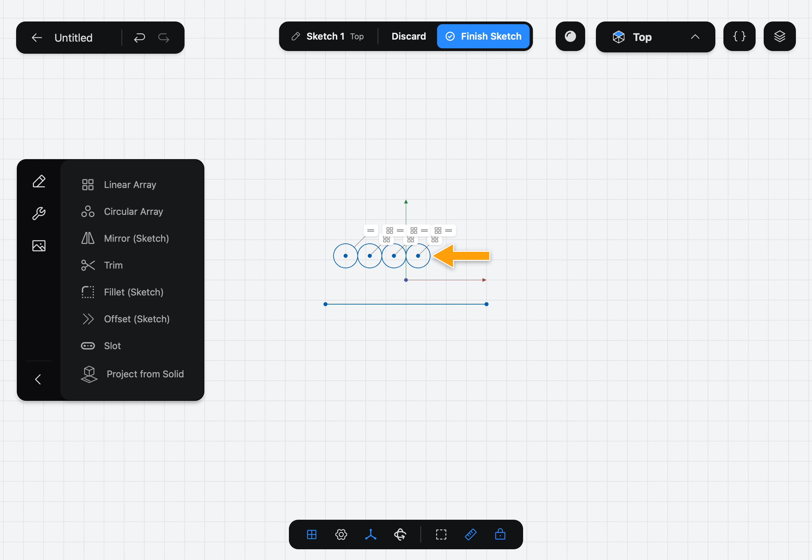

# Linear Array

Linear Array makes copies of shapes in a [Sketch](../../02-concepts/sketches/index.md), spaced evenly along a line. The copies stay tied to the original: change it, and every copy follows.

## When to use it

Use Linear Array for a row of equal holes, teeth, slots or ribs. For copies around a point, use [Circular Array](../circular-array/index.md). For a mirror image, use [Mirror (Sketch)](../mirror-sketch/index.md).

## Make a Linear Array

1. While you edit a sketch, tap the wrench icon at the top of the sidebar to show the sketch Tools, then tap **Linear Array**.

   

2. The step bar appears at the top of the canvas: **Linear Array**, **Select entities**. Tap each shape to copy. A count shows how many you have picked, and tapping a picked shape again drops it. Then tap **Next**.

   

   If you pick the shapes before you open the Tool, it skips this step and goes straight to the next.

3. The bar asks you to **Tap a line for the direction**. Tap the line the copies should run along. Only its direction matters: the copies start at the original, not on the line.

   

4. The copies appear as a preview, with two tags: the spacing between them and, after the ×, how many there are in all, the original included. Tap a tag and enter a new value.

   

5. Tap **Apply**. The copies are added to the Sketch.

   

## Options

- **Spacing** is the distance between one copy and the next. It starts at the width of the shapes you picked, so they sit side by side.
- **Count** is how many shapes there are, the original included. It starts at 4.
- The round handle past the last copy changes the spacing and the way the copies run: drag it along the line to space them further apart, or back past the original to run them the other way. Tap it to pick a different direction line.
- The **✕** in the bar cancels the Tool without changing the Sketch.

The copies are linked to the original by Constraints. To take a copy out of the pattern and move it freely, select it, tap **⋯** and pick **Detach from Linear Array**.

## Common problems

- **Next stays greyed out:** pick at least one shape first.
- **The copies run the wrong way:** drag the handle back past the original, or tap it and pick another line.
- **The copies overlap:** raise the **Spacing**.
- **I picked the wrong direction line:** tap the handle, then tap the right line. Tap **Keep Current** to leave it as it was.

> [!NOTE]
> **On Mac:** click wherever this page says tap. To change a tag, click it and type the value; there is no numpad.
