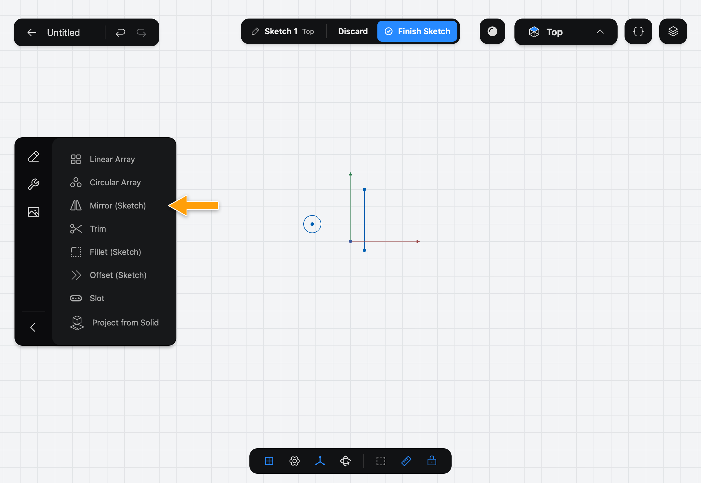
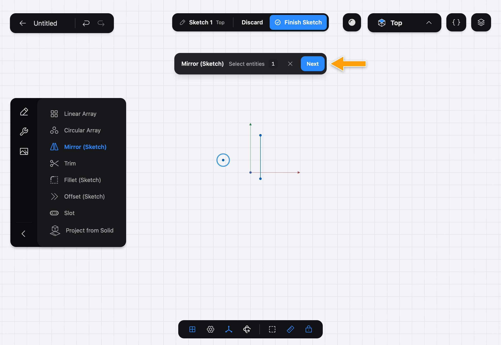
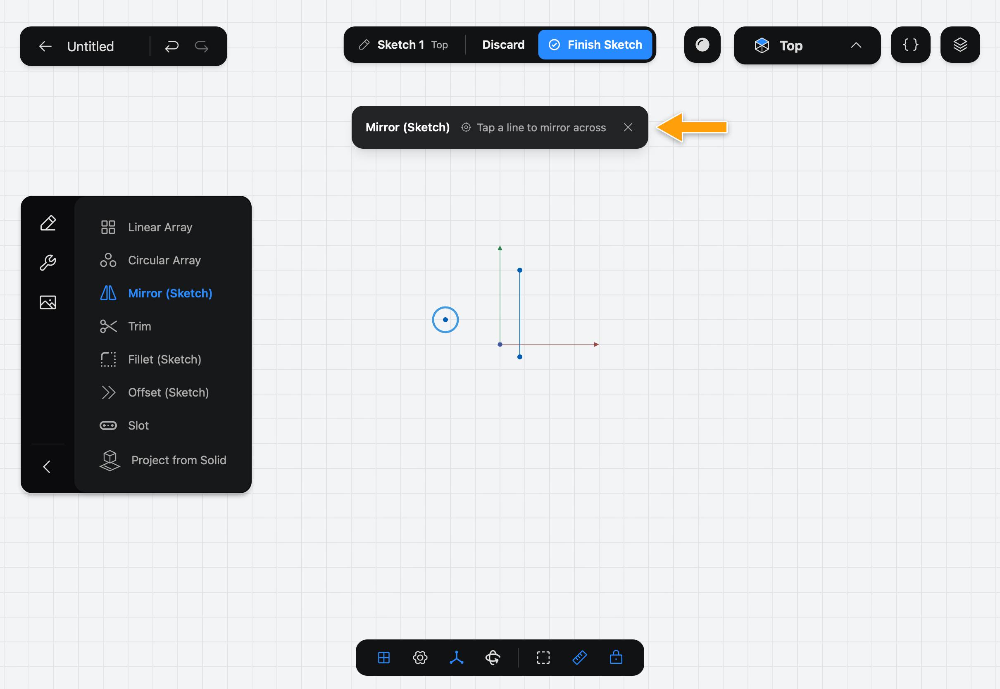
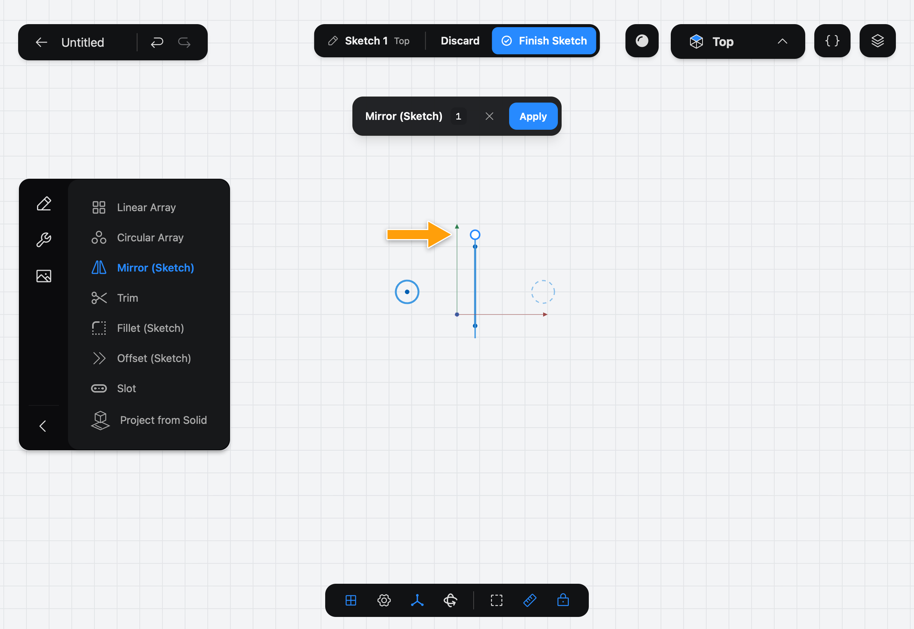
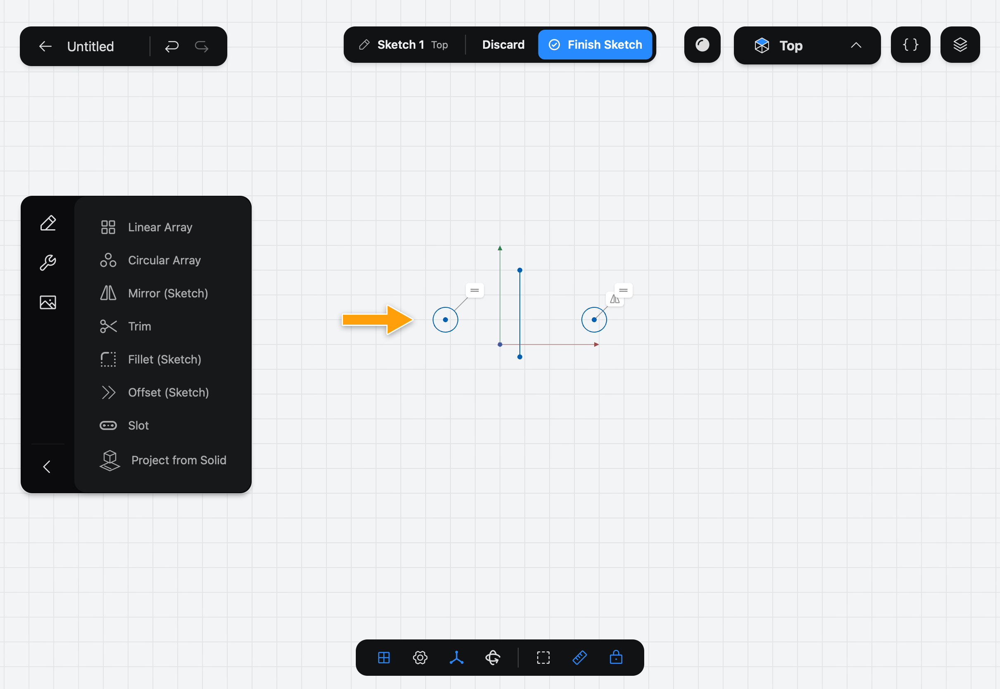

# Mirror (Sketch)

Mirror (Sketch) copies shapes in a [Sketch](../../02-concepts/sketches/index.md) as a mirror image across a line. The mirror image stays tied to the original.

> Mirroring a solid? See Mirror.

## When to use it

Use Mirror (Sketch) for symmetrical outlines: draw one half, mirror it across the middle. For repeated, not mirrored, copies, use [Linear Array](../linear-array/index.md) or [Circular Array](../circular-array/index.md).

## Mirror shapes

1. While you edit a sketch, tap the wrench icon at the top of the sidebar to show the sketch Tools, then tap **Mirror (Sketch)**.

   

2. The step bar shows **Mirror (Sketch)**, **Select entities**. Tap each shape to mirror, then tap **Next**. If you picked them before opening the Tool, it skips this step.

   

3. The bar asks you to **Tap a line to mirror across**. Tap the line that acts as the mirror. It can be any line in the Sketch, such as one you drew for the purpose.

   

4. The mirror image appears as a preview. The round handle at the end of the mirror line picks another line instead.

   

5. Tap **Apply**.

   

## Options

Mirror (Sketch) has no values to set. The **✕** in the bar cancels the Tool.

The mirror image is linked to the original by a Constraint: change the original and the copy follows. To free it, select it, tap **⋯** and pick **Detach from Mirror**.

## Common problems

- **Next stays greyed out:** pick at least one shape first.
- **The image is on the wrong side:** you picked the wrong mirror line. Tap the handle and pick another, or tap **Keep Current**.
- **There's no line to mirror across:** draw one with [Line](../line/index.md) first, and make it construction geometry with **Construction** in the **⋯** menu if you don't want it in the outline.

> [!NOTE]
> **On Mac:** click wherever this page says tap.
