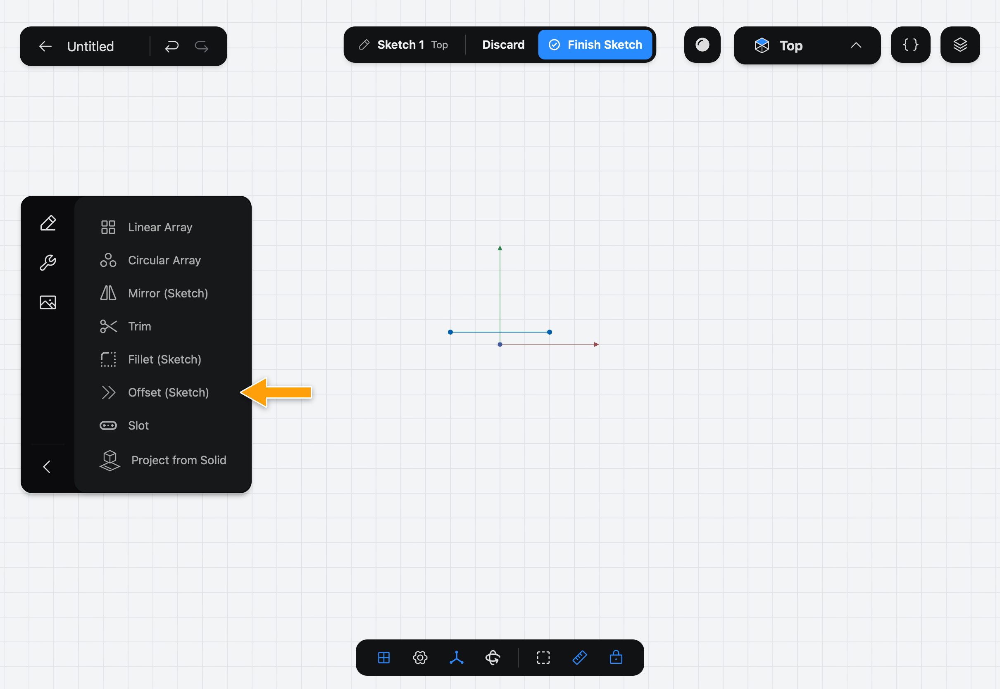
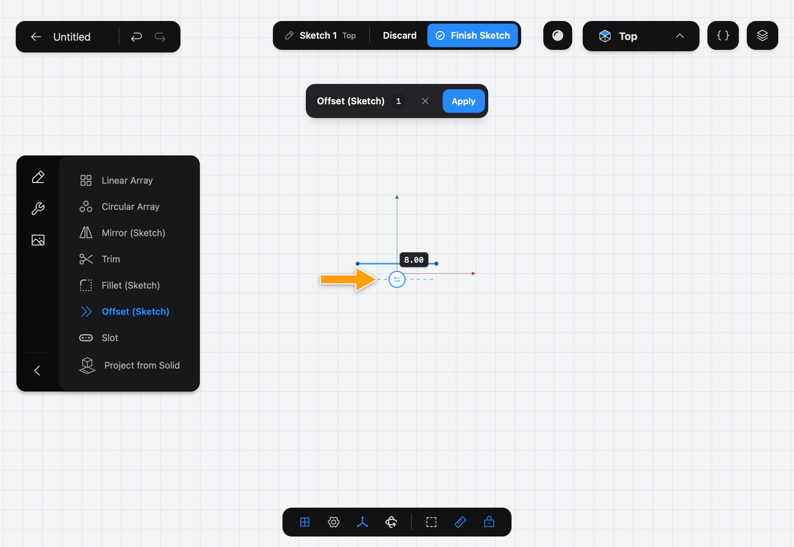
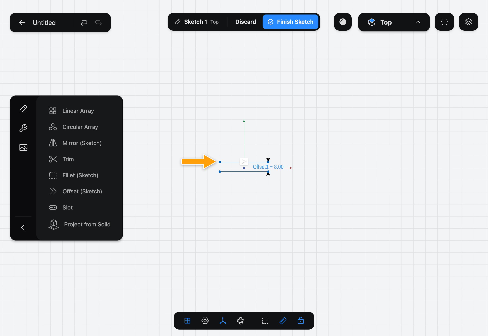

# Offset (Sketch)

Offset (Sketch) draws a copy of a chain of lines and arcs in a [Sketch](../../02-concepts/sketches/index.md) at a set distance from the original, on one side of it. The copy stays at that distance if you change the original.

> Offsetting a face of a solid? See Offset Face.

## When to use it

Use Offset (Sketch) to make a wall's inner and outer outline, a clearance gap around a part, or a border inside a shape. Around a closed shape, the offset can sit inside or outside it.

## Offset a chain

1. While you edit a sketch, tap the wrench icon at the top of the sidebar to show the sketch Tools, then tap **Offset (Sketch)**.

   

2. The step bar shows **Offset (Sketch)**, **Tap lines and arcs to offset**. Tap the lines and arcs of one connected chain. The offset appears as a dashed preview with a tag for its distance.

   

3. Tap the tag and enter the distance.

   

4. To put the offset on the other side, drag the round flip handle across the original. Where you let go sets the side and the distance together.

   

5. Tap **Apply**.

   

## Options

- **Distance** is how far the offset sits from the original. It starts at 1 mm and can't be zero.
- **Flip side** is the round handle on the offset. Drag it to the other side of the original to switch sides.
- The **✕** in the bar cancels the Tool.

The distance stays on the Sketch as a named value, such as **Offset1 = 8.00**: tap it later to change the distance. The offset is linked: if you change the original, or the distance, the offset follows. To take it out of the link, select it, tap **⋯** and pick **Detach from Offset**. If a later change means the offset can't tell what it follows, use **Redefine Offset Source** to pick the chain again.

## Common problems

- **A message says "Select only one connected chain":** the shapes you picked aren't joined end to end. Pick one connected chain at a time.
- **A message says "The offset distance can't be zero":** enter a distance above zero.
- **A message says the offset is too large for its source's arcs:** the distance is more than an arc in the chain can take, for example more than its radius on the inside. Enter a smaller distance.
- **Apply is greyed out:** pick at least one line or arc first.

> [!NOTE]
> **On Mac:** click wherever this page says tap. To change the distance, click the tag and type the value; there is no numpad.
