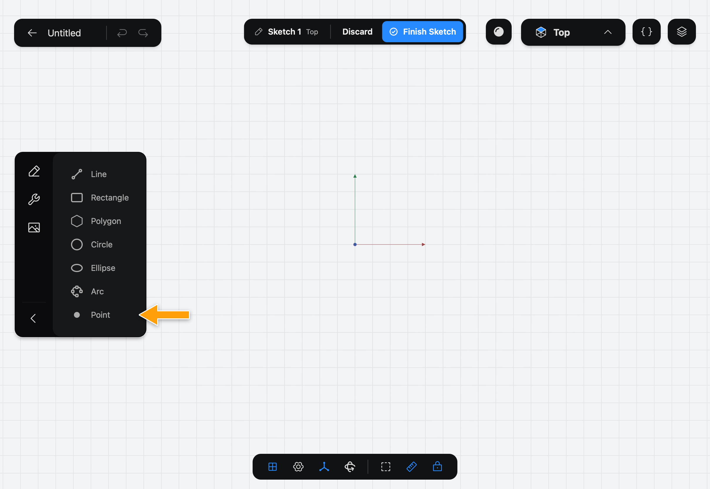
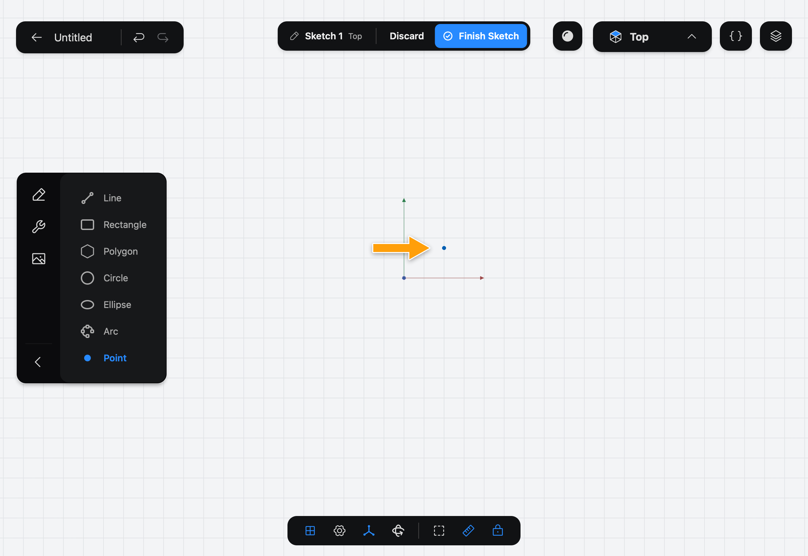

# Point

Point places a single dot in a [Sketch](../../02-concepts/sketches/index.md). Points are what other shapes are built from, and they are useful on their own as places to constrain to or to put holes.

## When to use it

Use Point to mark where a Hole goes, or to set a spot other shapes can snap and constrain to. In [Getting Started](../../01-getting-started/getting-started/index.md), two points mark the holes of the bracket. A sketch made only of points has no closed outline, so it can't be extruded.

## Place a point

1. While you edit a sketch, tap **Point** in the sidebar. If you don't see the drawing Tools, tap the pencil icon at the top of the sidebar.

   

2. With the Pencil, tap where the point should go.

   

A point snaps to the origin, to other points and to the ends and edges of other shapes, so press on one of them to place it exactly.

## Options

Point has no options. The keyboard shortcut is **P**.

## Common problems

- **The point landed in the wrong spot:** drag it to where you want it.
- **The point joined to a line instead of standing alone:** it snapped to the line. Place it away from other shapes, or turn off **Auto constraints** in the settings menu in the bar at the bottom of the screen.
- **Nothing was placed:** use the Pencil, not a finger.

> [!NOTE]
> **On Mac:** click with the mouse instead of tapping with the Pencil, and press **P** to pick the Tool. Pressing the key again puts it away.
