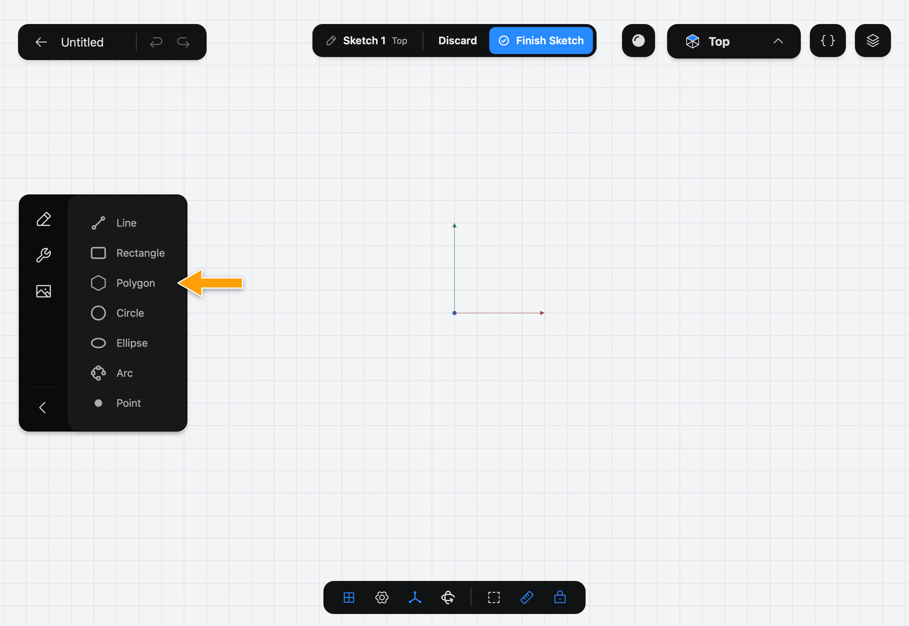
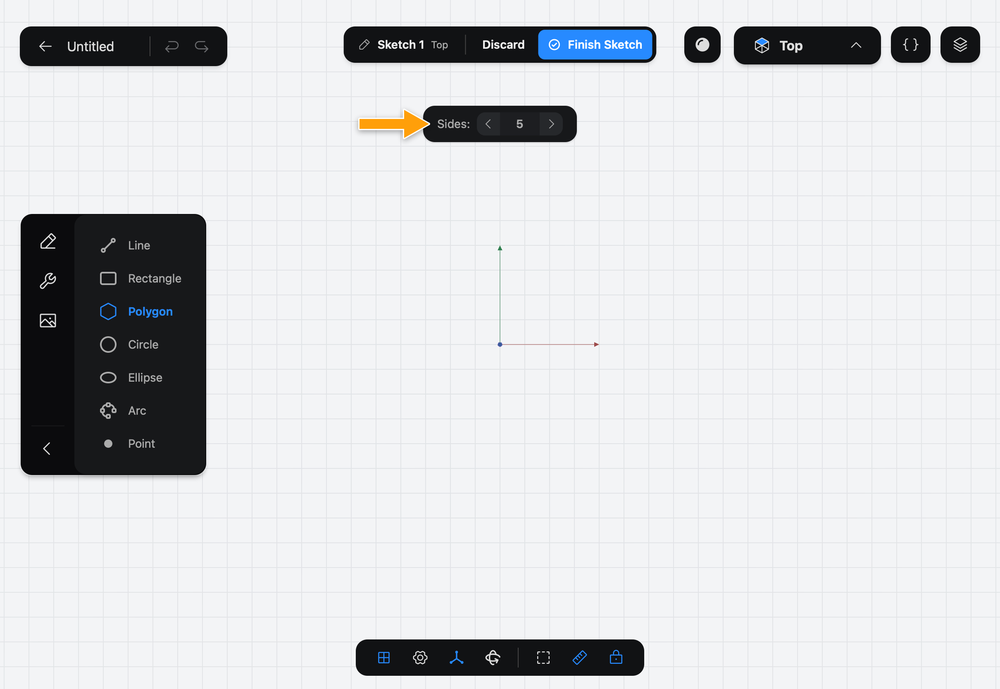

# Polygon

Polygon draws a regular polygon: every side the same length and every corner the same angle. It is built around a circle that Part3D draws as construction geometry, with each side touching the circle.

## When to use it

Use Polygon for hexagonal nuts and bolt heads, star-shaped bosses and any outline with equal sides. For unequal sides, use [Line](../line/index.md).

## Draw a polygon

1. While you edit a sketch, tap **Polygon** in the sidebar. If you don't see the drawing Tools, tap the pencil icon at the top of the sidebar.

   

2. The options bar shows **Sides**, set to 5. Tap the arrows on either side of the number to change it.

   

3. With the Pencil, press where the center should be, drag outward, and lift.

   

The distance you drag is the distance from the center to the middle of a side, and the direction sets where that side sits. A dashed construction circle shows this, with its diameter as a dimension. Change the dimension later to resize the whole polygon.

## Options

- **Sides** is how many sides the polygon has. It must be 3 or more, and starts at 5.

The keyboard shortcut is **G**.

## Common problems

- **The polygon is the wrong size:** its size is the circle that touches the sides, not its corners. Tap the dashed circle's dimension and set the value you want.
- **Sides won't go below 3:** a polygon needs at least three sides.
- **Nothing was drawn:** draw with the Pencil, not a finger.

> [!NOTE]
> **On Mac:** click and drag with the mouse instead of the Pencil, and press **G** to pick the Tool. Pressing the key again puts it away.
