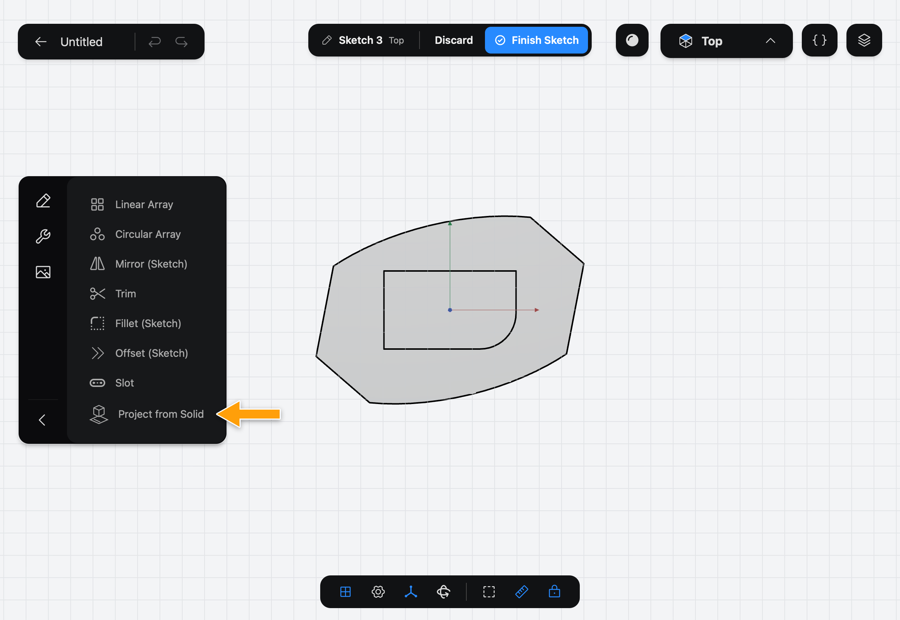
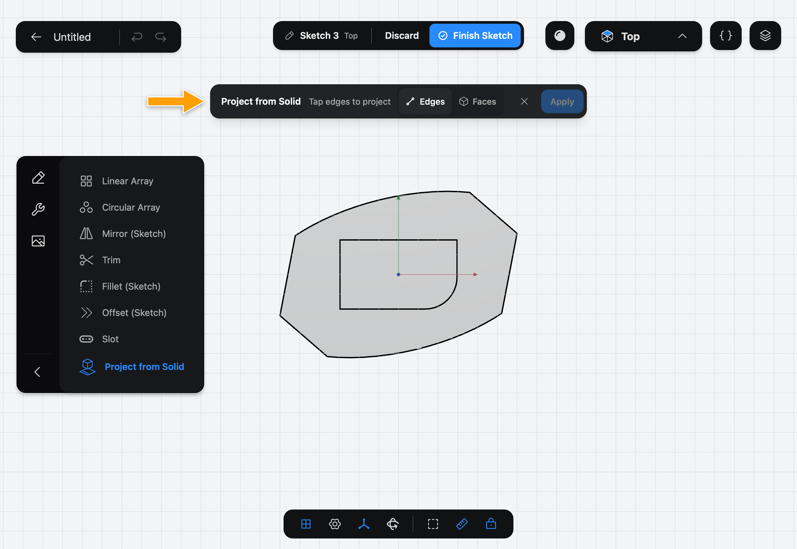
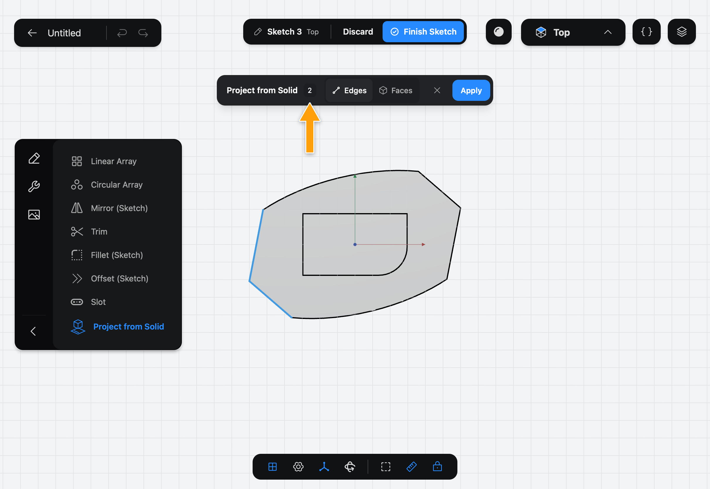
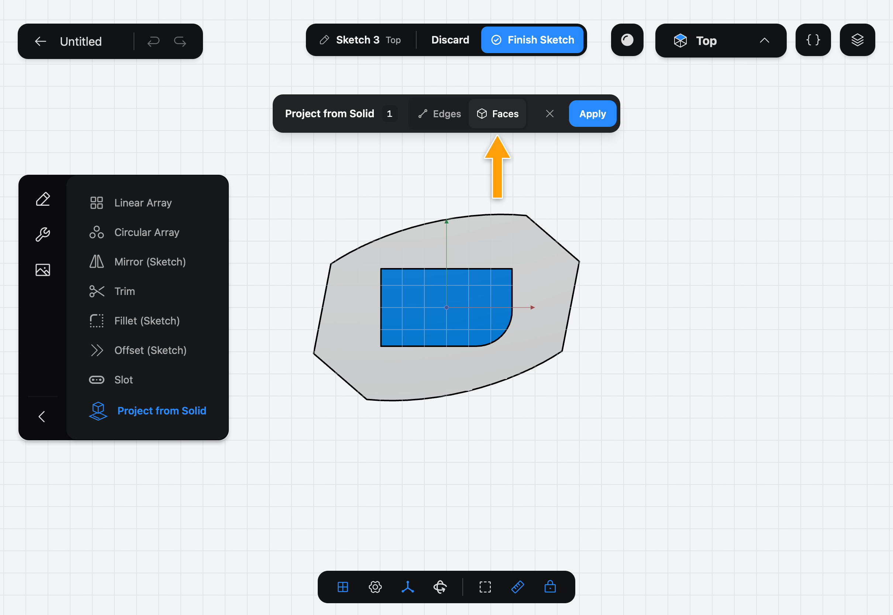
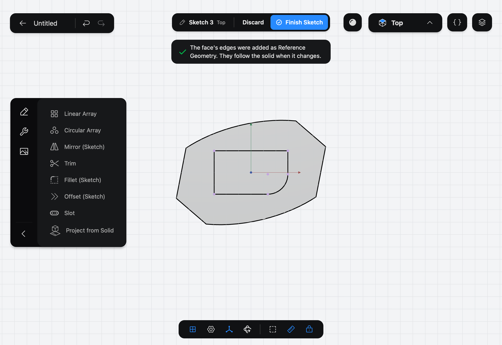

# Project from Solid

Project from Solid copies the edges of a solid you have already built onto the plane of the [Sketch](../../02-concepts/sketches/index.md) you are editing. The copies are **Reference Geometry**: you can draw next to them and constrain to them, but you can't move them, and they follow the solid if it changes.

## When to use it

Use Project from Solid to position a new shape against an existing part: a boss centered on another solid's outline, a slot that lines up with a hole, a cutout matching the shape of a face. Part3D also adds an edge or a corner of a solid to the Sketch when you snap or constrain to it, but Project from Solid brings in a whole set of edges at once.

## Project edges or a face

1. Start or edit a sketch on the plane you want to draw on. Tap the wrench icon at the top of the sidebar to show the sketch Tools, then tap **Project from Solid**.

   

2. The step bar shows **Project from Solid**, **Tap edges to project**, and a choice between **Edges** and **Faces**. **Edges** is selected. **Apply** is greyed out until you pick something.

   

3. Tap the edges of the solid you want. A count shows how many you have picked.

   

4. To project a face's whole outline instead, tap **Faces**. This clears your picks. The bar asks you to **Tap faces to project**: tap a face.

   

5. Tap **Apply**. The edges are added to the Sketch as Reference Geometry, and a message tells you so.

   

## Options

- **Edges** projects the edges you tap.
- **Faces** projects every edge of each face you tap. Switching between **Edges** and **Faces** starts your picks over.
- The **✕** in the bar cancels the Tool.

The projected edges stay in the Sketch until you delete them. If the solid changes later, they move with it, and so do the Constraints that use them. If a change removes the edge they came from, the Constraints on them are removed and the Sketch warns you which ones.

## Common problems

- **The solid isn't offered:** a sketch only sees the solids built before it in the History. A solid made by a later Feature can't be projected. See [Features and the History](../../02-concepts/features-and-history/index.md).
- **Apply is greyed out:** pick at least one edge or face first.
- **A message says nothing could be projected:** the edges you picked don't project to a line, circle, arc, ellipse or point on this plane, for example an edge seen end-on. Pick other edges, or sketch on another plane.
- **A message says some edges couldn't be projected:** the rest were added. Pick the others on another plane.
- **I can't move a projected line:** Reference Geometry is fixed to its solid. Draw next to it and constrain to it. See [Constraints](../constraints/index.md).

> [!NOTE]
> **On Mac:** click wherever this page says tap.
