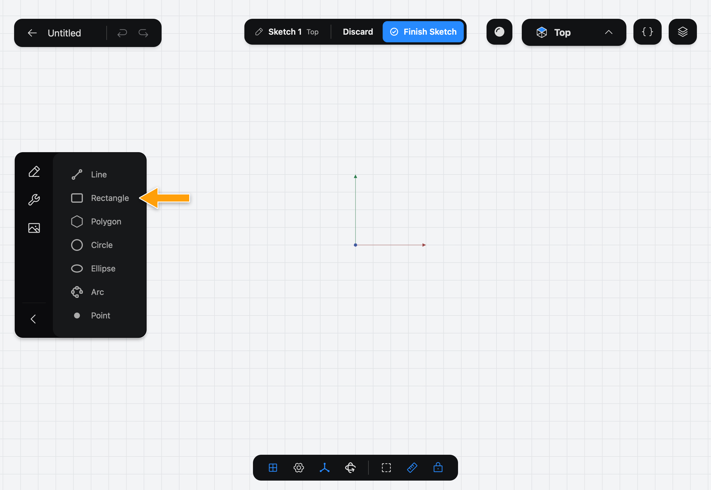
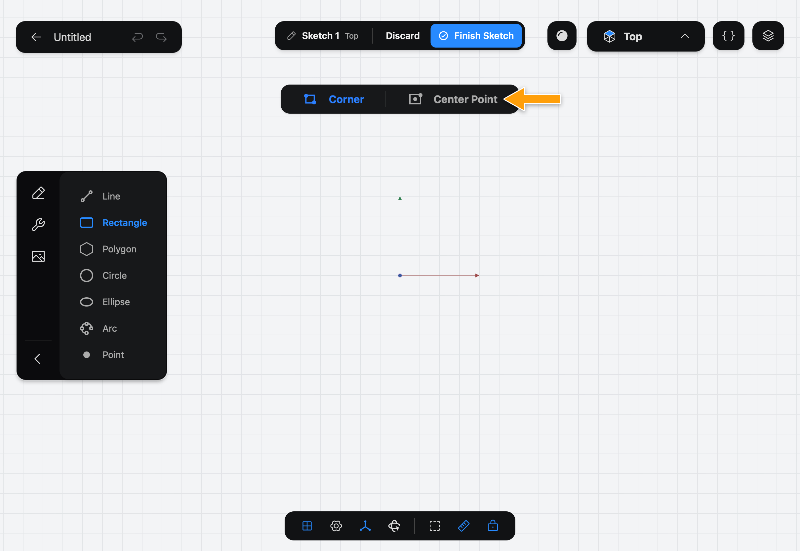
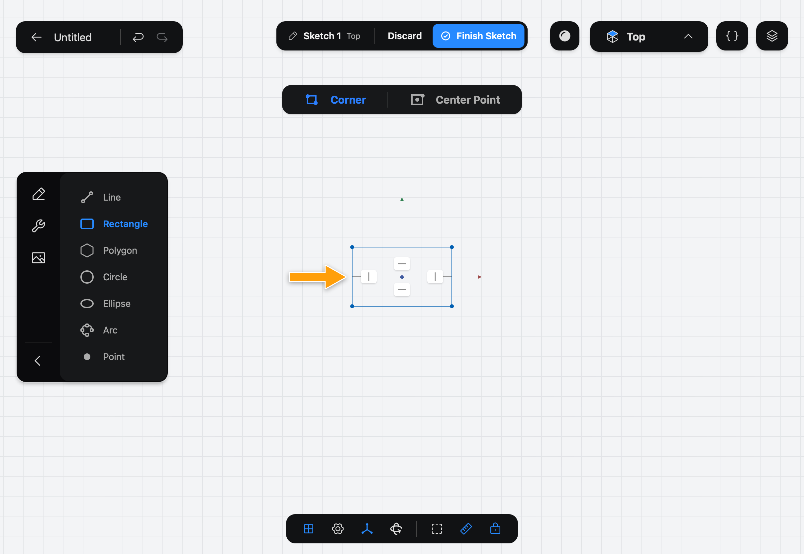

# Rectangle

Rectangle draws a four-sided outline in one stroke. It adds the lines and the **Horizontal** and **Vertical** Constraints that keep it square to the sketch.

## When to use it

Use Rectangle for plates, boxes, slots and any shape with four right-angled corners. It is the first shape in [Getting Started](../../01-getting-started/getting-started/index.md). For other shapes, see [Line](../line/index.md) and [Polygon](../polygon/index.md).

## Draw a rectangle

1. While you edit a sketch, tap **Rectangle** in the sidebar. If you don't see the drawing Tools, tap the pencil icon at the top of the sidebar.

   

2. The options bar shows **Corner** and **Center Point**. **Corner** is selected.

   

3. With the Pencil, press at one corner, drag to the opposite corner, and lift.

   

The sizes don't need to be exact. Set them afterwards by tapping an edge, tapping **⋯**, and picking **Distance**.

## Options

- **Corner**: the point where you press is one corner and the point where you lift is the opposite one.
- **Center Point**: the point where you press is the middle of the rectangle, and the point where you lift is a corner. The rectangle grows equally in every direction from the middle, which is handy for a shape centered on the origin.

The keyboard shortcut is **R**.

## Common problems

- **Nothing was drawn:** you drew with a finger, which only turns the view. Draw with the Pencil.
- **The rectangle isn't centered where I wanted:** use **Center Point** and press on the origin or on an existing point.
- **I can't turn the rectangle:** it stays square to the sketch. To get a tilted box, draw it with [Line](../line/index.md).

> [!NOTE]
> **On Mac:** click and drag with the mouse instead of the Pencil, and press **R** to pick the Tool. Pressing the key again puts it away.
