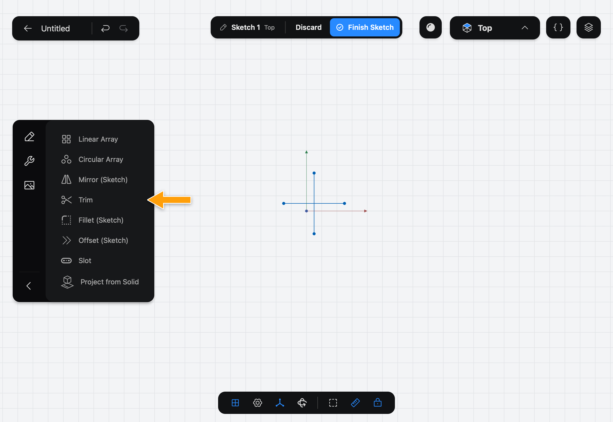
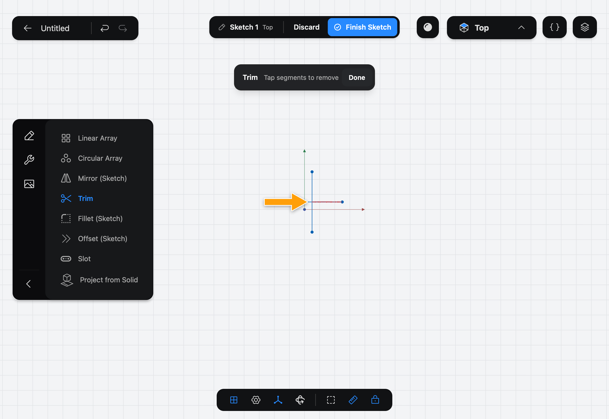
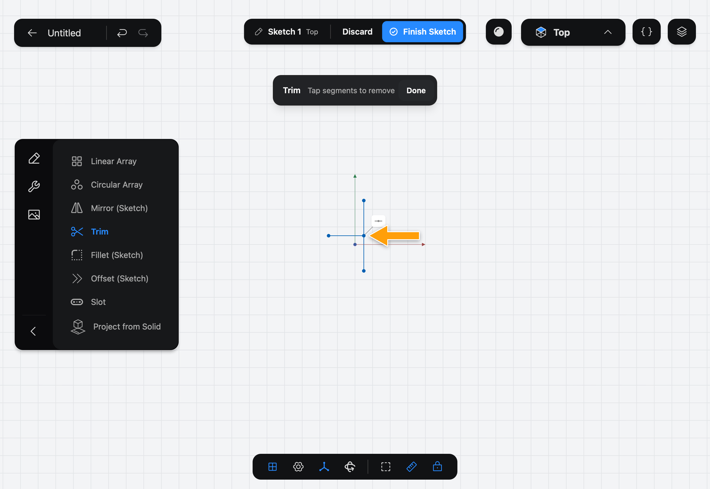

# Trim

Trim removes a piece of a line, arc or circle in a [Sketch](../../02-concepts/sketches/index.md): the part between the points where other shapes cross it, or between a crossing and the end.

## When to use it

Use Trim to clean up where shapes overlap: the stubs left when two lines cross, or the part of a circle inside another. To remove a whole shape, select it and use **Delete** instead.

## Trim a piece

1. While you edit a sketch, tap the wrench icon at the top of the sidebar to show the sketch Tools, then tap **Trim**.

   

2. The step bar shows **Trim**, **Tap segments to remove**. Hold the pointer over a shape, or touch it with the Pencil. The piece that would be removed is drawn dashed in red.

   

3. Tap the piece, or lift the Pencil. It is removed at once.

   

4. Trim more pieces the same way. Tap **Done** when you finish.

## Options

Trim has no options. Each tap applies at once, so there is no **Apply** and no **✕**: **Done** (or **Esc**) closes the Tool. To take a trim back, use **Undo**.

With the Pencil, the red preview shows when you touch down and follows the Pencil as you slide it. Lifting trims the piece you are over. Slide off every shape before lifting and nothing is trimmed.

## Common problems

- **The wrong piece is removed:** tap **Undo** and trim again, this time checking the red preview first.
- **I tapped a point and the point stayed:** points are never trimmed. Tapping where a shape ends trims the nearest line, arc or circle instead.
- **A message says trimming ellipses isn't supported:** Trim does not work on ellipses yet. Delete the ellipse, or redraw it.
- **A message says the mirror or pattern relation was removed:** trimming a copy made by [Mirror (Sketch)](../mirror-sketch/index.md) or an array takes it out of that pattern.

> [!NOTE]
> **On Mac:** click wherever this page says tap. Hold the pointer over a shape to preview a trim, click to trim.
