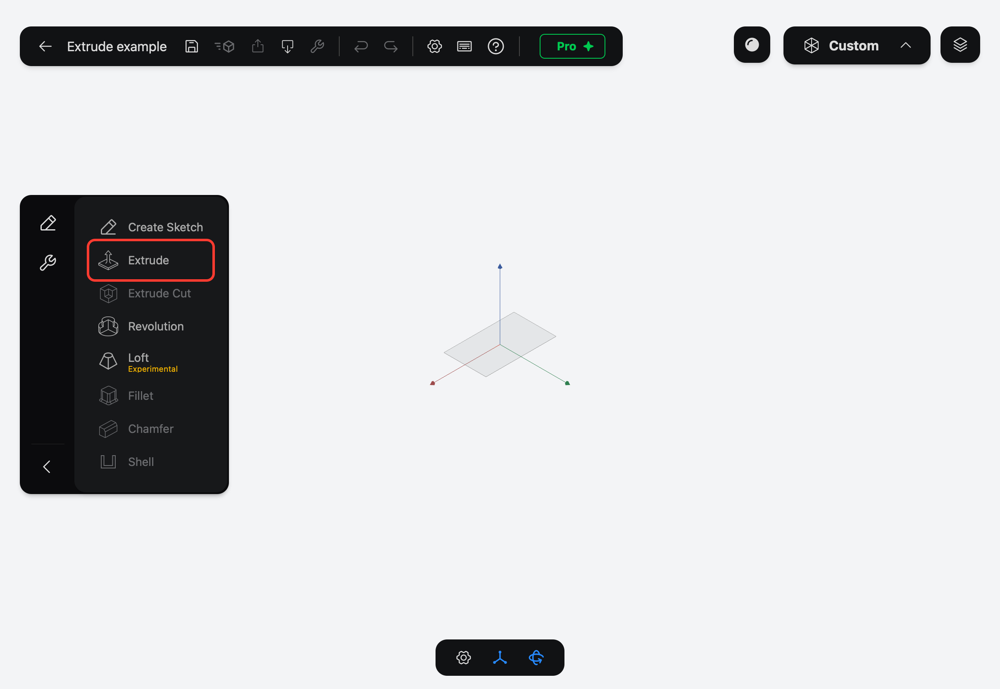
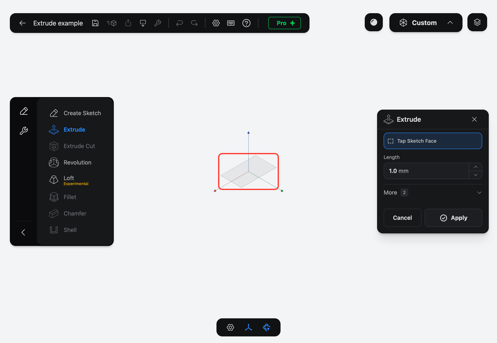
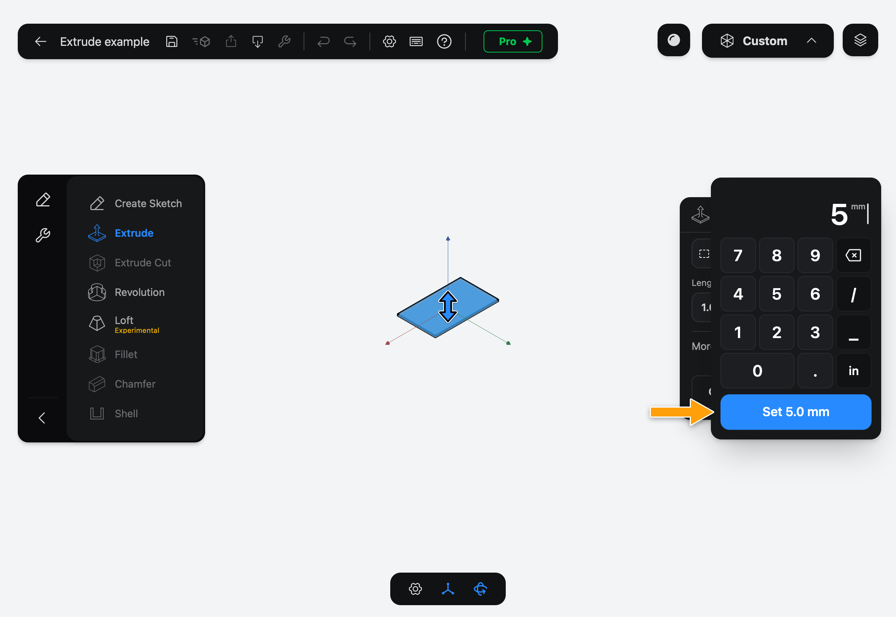
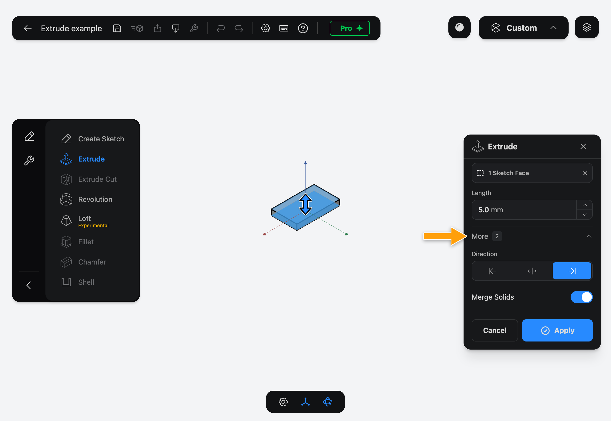
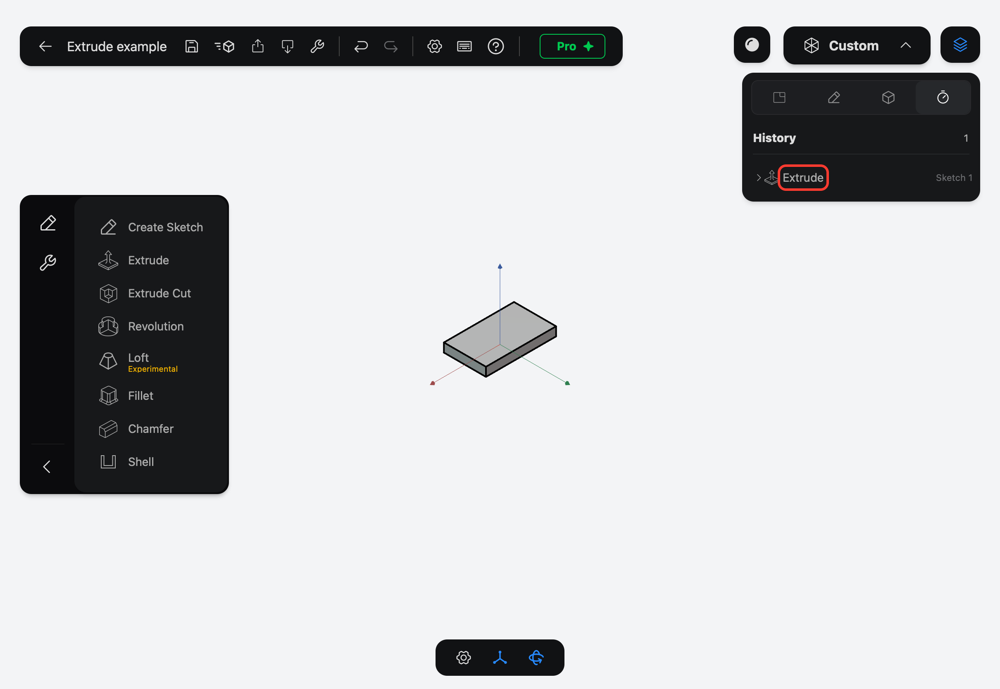

# Extrude

Extrude pushes a closed Sketch Face straight out from its sketch to make a solid, and adds an Extrude Feature to the History. A rectangle becomes a plate, a circle becomes a cylinder.

## When to use it

Use Extrude for most first solids: any shape with straight walls whose outline you can draw in one sketch. It's also how you add a boss or a rib onto an existing solid. To cut material away instead, use Extrude Cut.

## Create an Extrude

1. In the sidebar, tap **Extrude**. If you don't see it, tap the pencil icon at the top of the sidebar to show the Features tab.

   

2. The **Extrude** panel opens and asks you to **Select Sketch Face**. Tap inside a closed profile of your sketch. The field changes to **1 Sketch Face** and a preview appears. You can tap more faces from the same sketch to extrude them together.

   

3. Tap the **Length** value to open the numpad, enter `5`, and tap **Set 5.0 mm**. The preview grows to the new length.

   

4. Tap **More** to show **Direction** and **Merge Solids**. The defaults suit most cases.

   

5. Tap **Apply**. The solid is created and the Extrude Feature is added to the History. To see it, tap the layers icon in the top-right corner, then the History tab (the timer icon).

   

## Options

- **Length** is how far the profile is pushed out, in the Document's units. It must be more than zero, and starts at 1 mm. Besides the numpad, you can nudge it with the arrows next to the value, or drag the blue arrow in the preview.
- **Direction** picks which side of the sketch the solid grows on:
  - the right arrow (the default) grows it toward the side the sketch faces,
  - the left arrow grows it toward the opposite side,
  - the middle button grows it both ways, half of the **Length** on each side.
- **Merge Solids** is on by default: if the new solid overlaps or touches an existing solid, the two are joined into one. Turn it off to always get a separate solid.
- The **Sketch Face** field shows how many faces are picked. Tap its **×** to clear them and pick again.

> [!TIP]
> With a keyboard, press **E** to open Extrude when no sketch is being edited.

## Common problems

- **Tapping the sketch picks nothing:** the profile isn't closed. Edit the sketch and close every gap so its outline forms a loop, then open Extrude again.
- **Apply stays greyed out:** pick at least one Sketch Face and make sure **Length** is more than zero.
- **The solid grew the wrong way:** change **Direction** under **More**, or drag the blue arrow the other way.
- **The new solid was joined to one you wanted to keep separate:** turn off **Merge Solids** under **More** and apply again.

> [!NOTE]
> **On Mac:** click wherever this page says tap. To set **Length**, click the value and type the number; there is no numpad.
